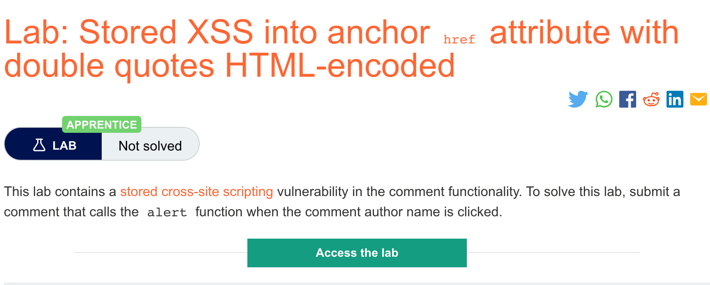
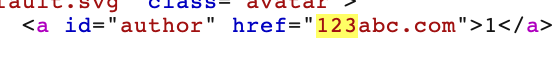

# 题意

该实验中的评论功能存在存储型XSS。提交一次评论后，实现当作者名字被点击时唤起alert().

# 解题思路
step1:
在任意博客提交任意的内容，将website字段填写成123abc.com。提交完成之后用burpsuite进入博客页面查看评论：




可以看到输入的网站字符串被双引号包含在href属性中。

step2:
再次提交评论，提交内容如下:
```
javascript:alert(1)
```
提交成功后，在博客页面点击对应的网站就会唤起alert()
# 知识点
