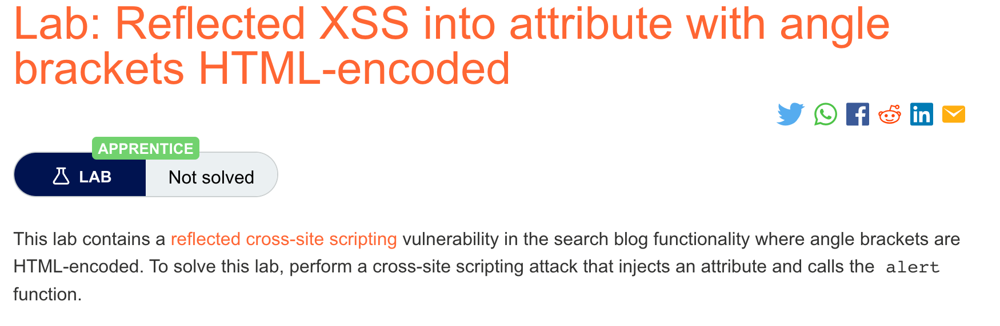
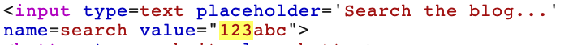

# 题意


该实验中的搜索处有反射型XSS漏洞，但是尖括号被HTML编码了。因此，需要注入跟属性有关的payload并唤起alert()。
# 解题思路
step1:

打开repeater，并在实验页面输入随机字符串搜索。得到响应之后在response里搜索字符串：



可以看到字符串作为属性被双引号包括。

step2:

输入如下payload即可。
```
"onmouseover="alert(1)
```
# 知识点
html标签属性中的XSS
当XSS上下文在html标签属性之间时，需要将属性值终结，关闭标签并且引入一个新的标签。例如
```
"><script>alert(document.domain)</script>
```
一般来说，尖括号会被过滤或者编码，所以直接输入不能打破原来的标签。如果可以终止属性值，通常可以引入一个新属性来创建可编写脚本的上下文，例如事件处理程序：
```
" autofocus onfocus=alert(document.domain) x="
```

上列payload创建了一个聚焦事件。当元素被聚焦时就会执行JS。同时autofocus属性尝试在没有用户交互时也能触发聚焦事件。 


x=优雅地修复标记？
