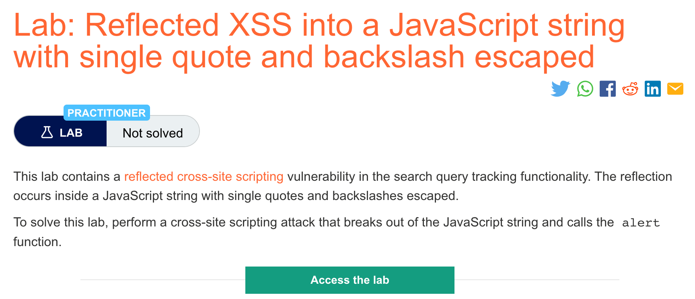
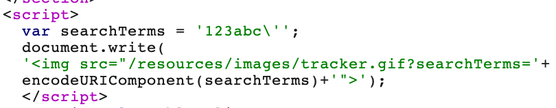
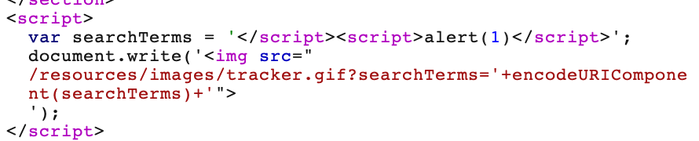

# 题意

该实验的搜索功能存在反射型XSS漏洞。并且会用反斜杠转义单引号。利用XSS漏洞唤起alert()
# 解题思路
step1:
输入带单引号的随机字符串并观察响应


可以看到单引号被反斜杠转义了。

step2:在搜索栏中输入如下payload
```
</script><script>alert(1)</script>
```
点击搜索后发现alert()被唤起，响应结果如下：

# 知识点
当XSS的上下文存在与响应的JS中时，会有很多种情况出现，要用不同的技术利用。
最简单的情况，就是能直接闭合script标签，然后引入一些新的能够触发JS执行的HTML标签。例如：
```
<script>
...
var input = 'controllable data here';
...
</script>
```
就可以用如下payload来跳出JS并执行自己的语句：

```
</script>
```
原理是浏览器会先执行HTML解析来验证包括script块在内的网页元素，随后才会执行JS解析来理解并执行嵌入的scripts。
