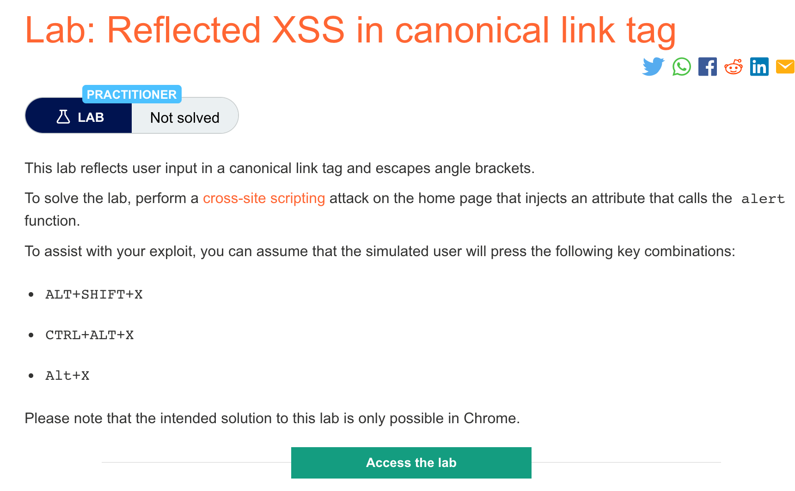
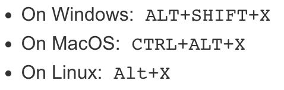

# 题意

实验存在反射型XSS，用canonical link标签反射用户输入。为了完成实验，可以假定用户会按下accesskey对应的快捷键。


# 解题思路
1. 在实验的url后加入如下payload并访问
```
/?%27accesskey=%27x%27onclick=%27alert(1)
```

2. 进入页面后按对应的快捷键(control+alt+x,x由accesskey的值决定)，即可弹出alert窗口
# 知识点


## accesskey

HTML教程标签中的AccessKey属性相当于Windows应用程序中的Alt快捷键。该属性可以设置某个HTML元素的快捷键，这样就可以不用鼠标定位某个页面元素，而只用快捷键Alt 键和某个字母键，就可以快速切换定位到页面对象上.

## canonical link

就网站SEO优化而言，canonical标签意义在于规范网址，在众多指向同一页面的网址中，告诉搜索引擎哪个网址才是最主要的。使用方法很简单，就是在
```
<meta>和</meta>之间加入<link rel=”canonical” href=”网页权威链接”/>即可。例如<link rel=”canonical” href=”http://www.abc.com/a.html”/>。
```