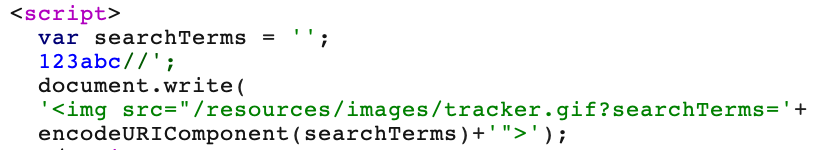
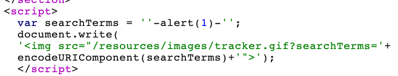

# 题意

与上一题一样，也是搜索功能有XSS漏洞，并且尖括号被编码。利用漏洞唤起alert()即可。
# 解题思路
step1:
输入测试字符串123abc>

可以看到>被编码。

step2:
尝试跳出单引号：



可以看到两种方法都成功跳出了单引号。

step3:
输入payload
```
';-alert(1)//

'-alert(1)-'
```

两种都可以



# 知识点