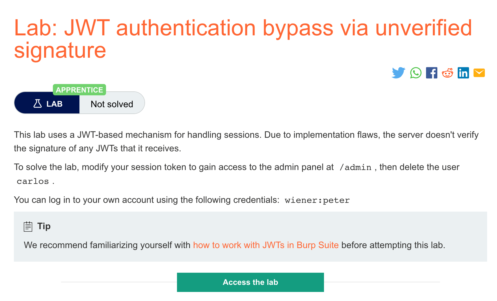
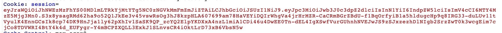
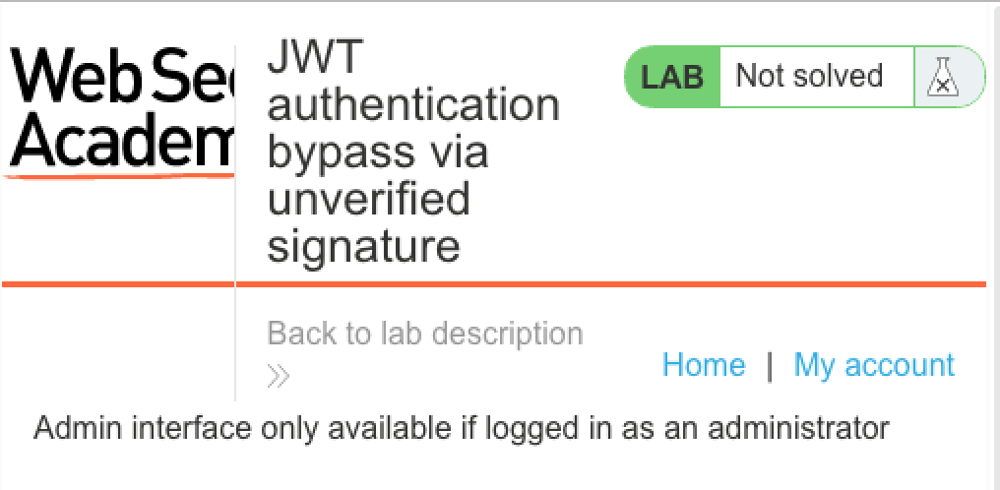
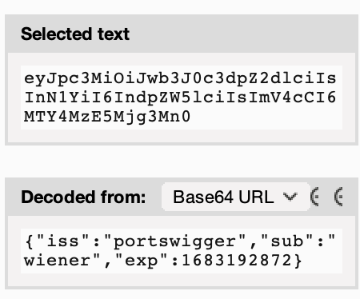
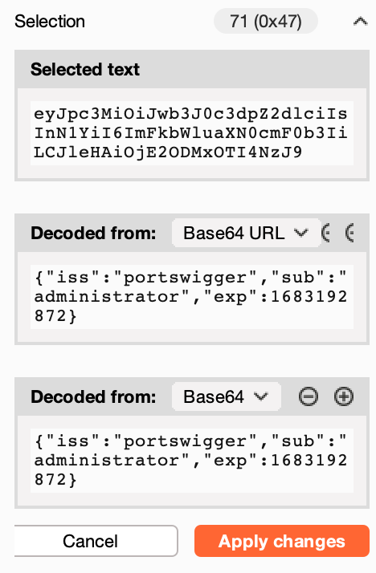
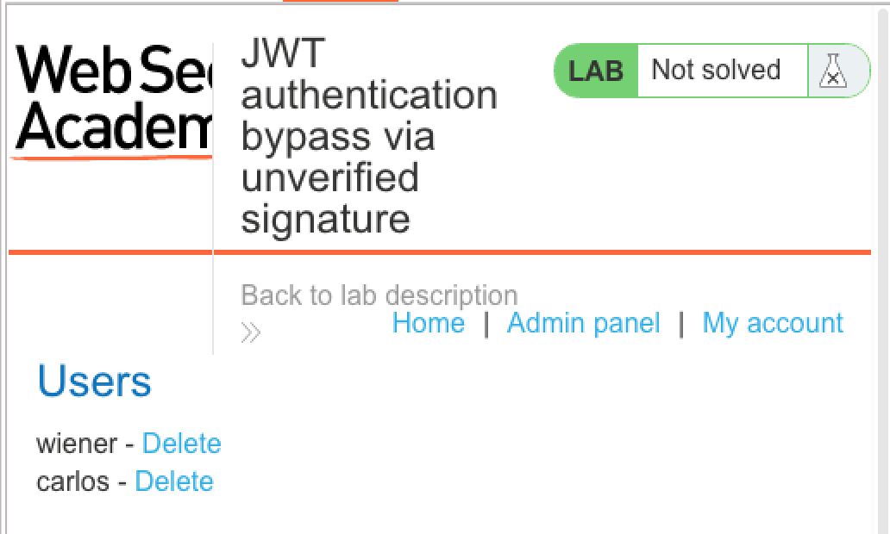

# 题意

该实验中的JWT机制没有对签名进行验证。需要获取管理员页面的权限并且删除用户carlos
# 解题思路

step1:


用burpsuite拦截对实验中登录页面的访问，可以看到session cookie是一个JWT


当用普通用户登录admin页面时，结果如下：

step2：

选中JWT中的payload部分，在inspector部分可以看到解码的结果：



对解码部分进行修改，将sub字段修改成administrator，并且将url改成/admin



step3:
发送修改后的请求：


可以看到成功进入了admin页面，再通过修改url来删除carlos用户(/admin/delete?username=carlos)

## 知识点

## JWT
JSON web tokens(JWTs)是一种为了在系统之间传输带加密签名的JSON数据的标准格式。理论上可以包含任意种类的数据格式，但通常用来发送用户相关的数据，包括授权、session处理和访问控制。与传统session和token不同的是，所有服务器需要的数据都用JWT存储在客户端。这让JWT成为了高分布式网站的优选。


## JWT格式
一个JWT包含三个部分：header、payload、signature。三个部分由点号（.）分割。

例如：
```
eyJraWQiOiI5MTM2ZGRiMy1jYjBhLTRhMTktYTA3ZS1lYWRmNWE0NGM4YjUiLCJhbGciOiJSUzI1NiJ9.
eyJpc3MiOiJwb3J0c3dpZ2dlciIsImV4cCI6MTY0ODAzNzE2NCwibmFtZSI6IkNhcmxvcyBNb250b3lhIiwic3ViIjoiY2FybG9zIiwicm9sZSI6ImJsb2dfYXV0aG9yIiwiZW1haWwiOiJjYXJsb3NAY2FybG9zLW1vbnRveWEubmV0IiwiaWF0IjoxNTE2MjM5MDIyfQ.
SYZBPIBg2CRjXAJ8vCER0LA_ENjII1JakvNQoP-Hw6GG1zfl4JyngsZReIfqRvIAEi5L4HV0q7_9qGhQZvy9ZdxEJbwTxRs_6Lb-fZTDpW6lKYNdMyjw45_alSCZ1fypsMWz_2mTpQzil0lOtps5Ei_z7mM7M8gCwe_AGpI53JxduQOaB5HkT5gVrv9cKu9CsW5MS6ZbqYXpGyOG5ehoxqm8DL5tFYaW3lB50ELxi0KsuTKEbD0t5BCl0aCR2MBJWAbN-xeLwEenaqBiwPVvKixYleeDQiBEIylFdNNIMviKRgXiYuAvMziVPbwSgkZVHeEdF5MQP1Oe2Spac-6IfA
```
header和payload部分是JSON对象的base64url编码。header包括token本身的元数据；payload包含user的相关信息，payload解码后的JSON信息如下：
```
{
    "iss": "portswigger",
    "exp": 1648037164,
    "name": "Carlos Montoya",
    "sub": "carlos",
    "role": "blog_author",
    "email": "carlos@carlos-montoya.net",
    "iat": 1516239022
}
```

在多数情况下，这些数据能被有访问权限的人读写，安全的保证来自于加密签名。

## JWT签名
通常服务器通过对header和payload的哈希生成签名，有时也会对签名进行加密，但其中都涉及到加密key。这种机制为服务器提供了一种验证数据是否被篡改的方法：

1. 发送过程中对header和payload的改变会导致生成的签名不匹配。
2. 如果不知道key，不可能生成给定header和payload对应的签名。


# JWT攻击
JWT攻击涉及一个用户为了恶意目标发送修改的JWT给服务器。通常，这个目标是伪装成授权用户绕过授权和访问控制。

# JWT的攻击原理
JWT漏洞一般因为应用程序本身在JWT处理部分存在瑕疵。与JWT相关的设计规范一般都比较灵活，允许开发者决定许多扩展和细节。这就可能导致开发者在使用常用的库时引入一些漏洞。这些额外的瑕疵通常意味着JWT签名没有合适地验证。这导致攻击者能够通过token里的payload来修改发送给应用程序的值。即使签名被完整验证，其是否可信取决于服务器上的密钥是否还保密。当密钥被泄漏时，攻击者就能为任意的token生成可用的签名。
