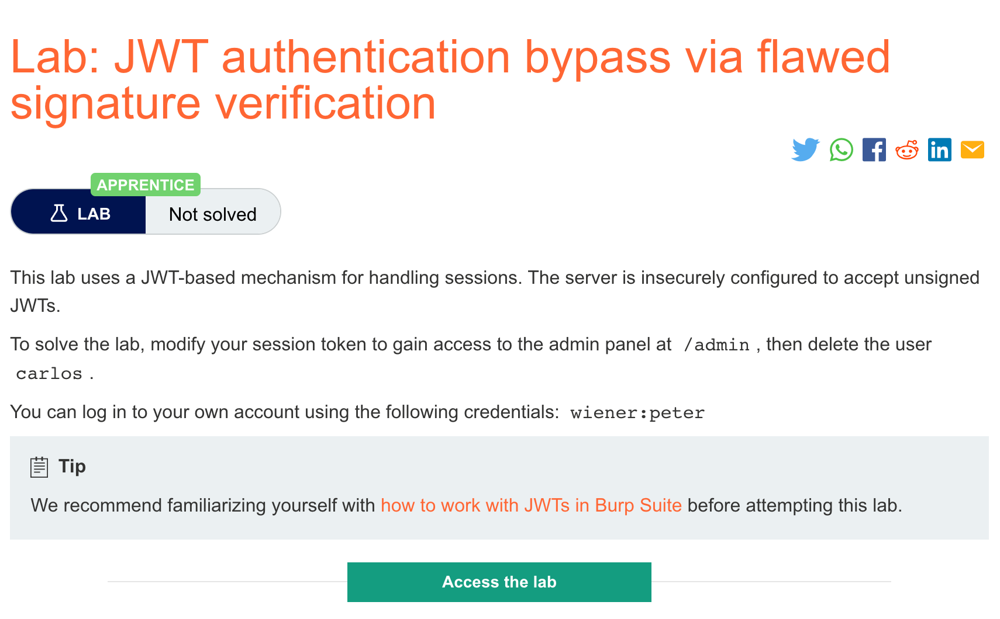
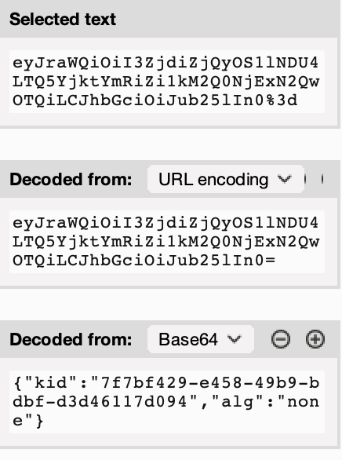
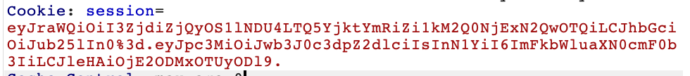

# 题意

目标与上一实验一样，登录到admin页面并删除carlos用户。
# 解题思路
解题思路也与上一题基本一致，但是有两处不同：
1. 要将header中的alg字段改成none：
   


2. 要将JWT的签名字段删除，但是注意要保留（.）。

 
# 知识点
## 没有签名的token
JWT的header有一个alg参数，它告诉服务器要用哪种算法进行签名：
```

{
    "alg": "HS256",
    "typ": "JWT"
}
```
这是一个内部漏洞，因为服务器除了相信用户可控的输入以外没有选择。攻击者可以直接影响服务器如何检查token是否可信。
JWT可以被很多不同的算法签名，但同时也可以不进行签名。在这种情况下，alg参数会被设置成none，此时被称为不安全的JWT。由于这个很明显的漏洞，服务器通常会拒绝没有签名的token。然而，由于这种过滤基于字符串解析，有时可以用经典的混淆方式绕过这些过滤。例如mixed capitalization和unexpected encodings.