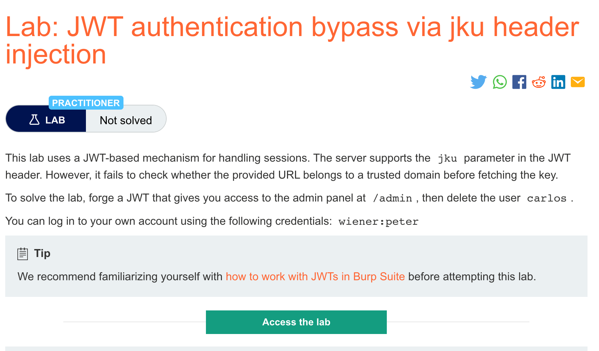
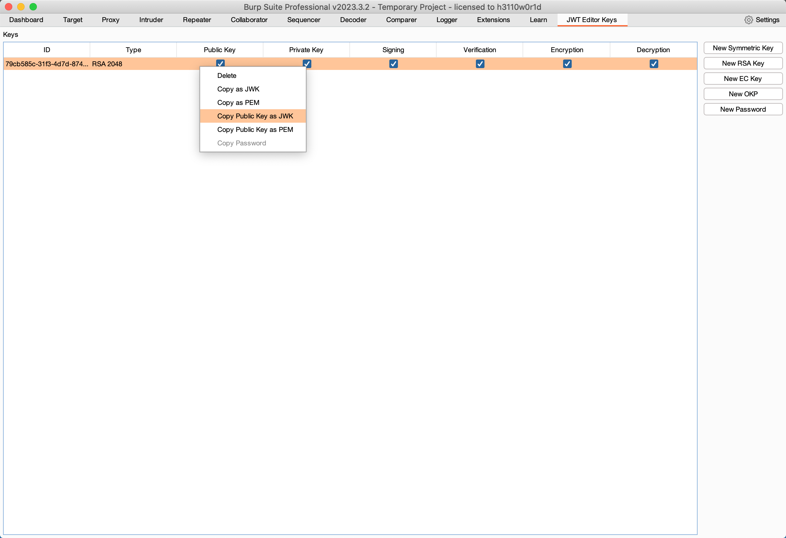
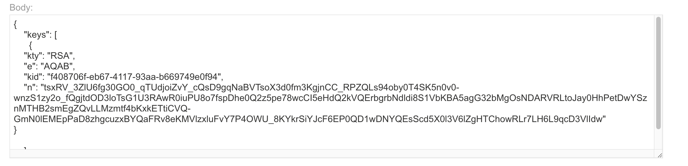
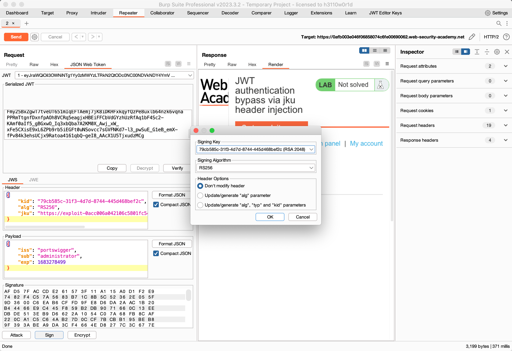

# 题意


# 解题思路
主要分成两个部分：
part1:上传恶意的JWK集

与之前的实验一样，用JWT Editor Keys生成密钥,然后按照如图选项复制到exploit 服务器上。




复制完成后点击stored。

part2:修改JWT并生成签名

将JWT按照如下图设置
其中sub字段要改成administrator；kid字段要改成与复制到服务器上的kid字段一样；
还需要增加一个jku字段，值为exlpoit的url地址。注意json格式每个字段之间要用逗号隔开。




设置好了之后send即可。
# 知识点
## jku参数注入
一些服务器用jku（JWK Set URL）header参数来获取包含了密钥的JWK集合。等确认了签名之后，服务器就会从这个url获取相关的密钥。
JWK集合的例子如下：

```
{
    "keys": [
        {
            "kty": "RSA",
            "e": "AQAB",
            "kid": "75d0ef47-af89-47a9-9061-7c02a610d5ab",
            "n": "o-yy1wpYmffgXBxhAUJzHHocCuJolwDqql75ZWuCQ_cb33K2vh9mk6GPM9gNN4Y_qTVX67WhsN3JvaFYw-fhvsWQ"
        },
        {
            "kty": "RSA",
            "e": "AQAB",
            "kid": "d8fDFo-fS9-faS14a9-ASf99sa-7c1Ad5abA",
            "n": "fc3f-yy1wpYmffgXBxhAUJzHql79gNNQ_cb33HocCuJolwDqmk6GPM4Y_qTVX67WhsN3JvaFYw-dfg6DH-asAScw"
        }
    ]
}
```