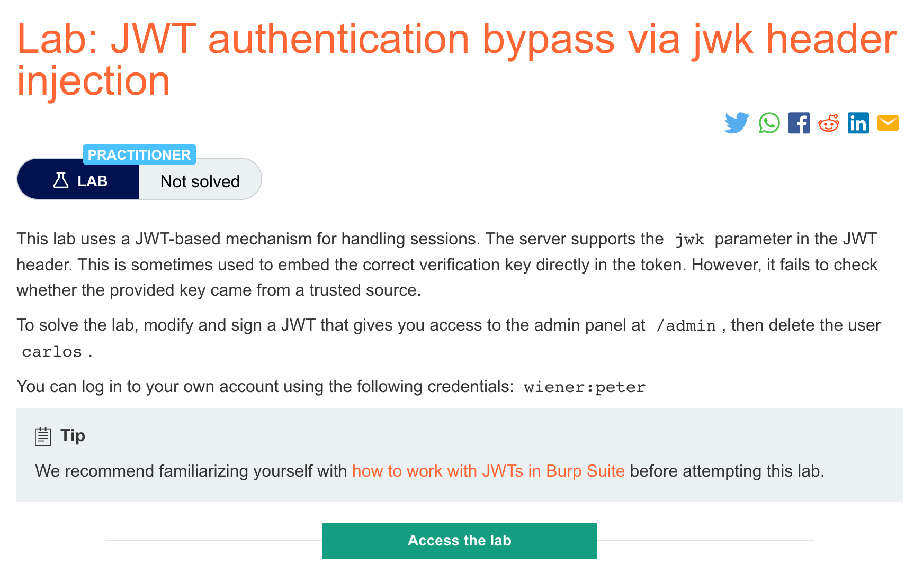
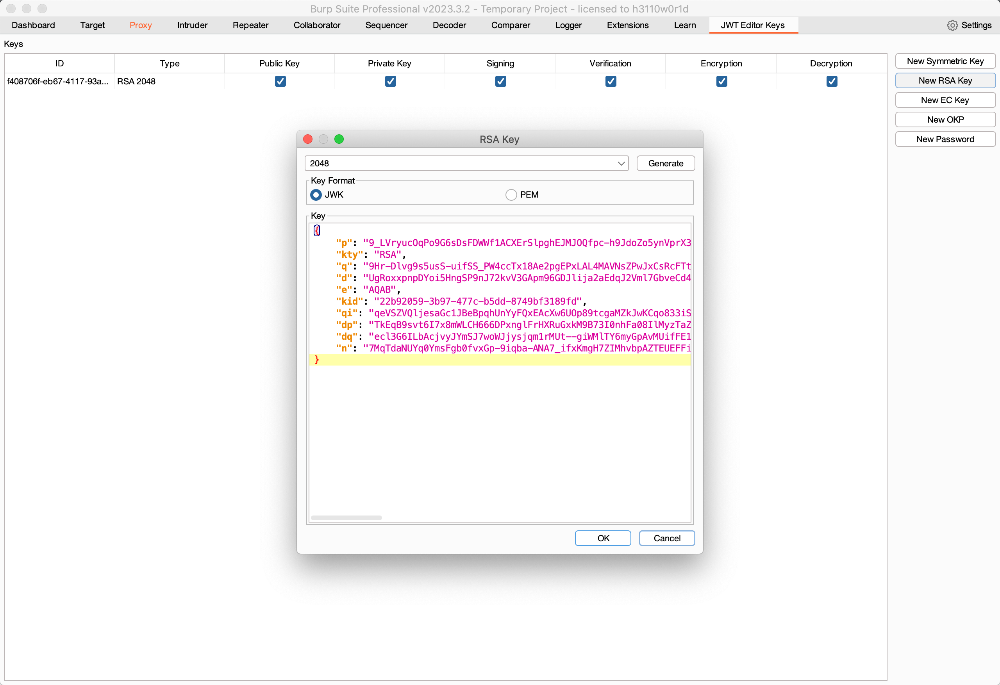
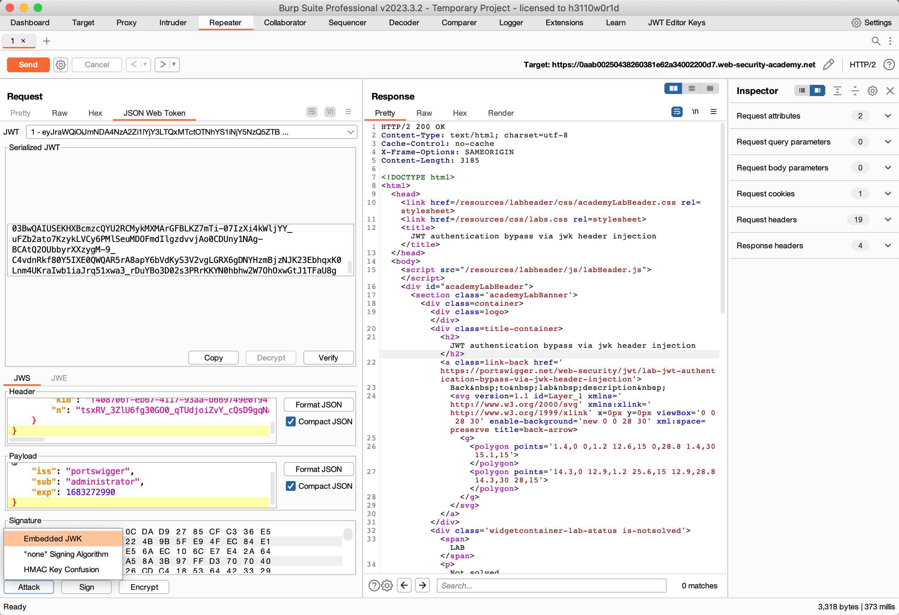
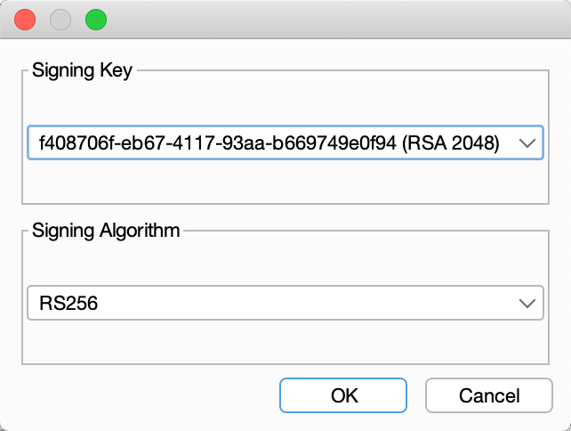

# 题意

该实验采用JWT机制来处理会话。服务器支持JWT header中的jwk参数，这个参数通常用来嵌token中正确的密钥。然而，该实验中的服务器没能检查密钥是否可信。与前两个实验一样，需要登录到admin页面并且删除carlos。
# 解题思路
step1:

与前两个实验一样，用burpsuite拦截请求，不再赘述。

step2:

生成RSA密钥



step3:

将jwk参数改成生成的密钥




记得将sub改成administrator，在url中改成GET /admin




修改完毕后发送请求即可。
# 知识点
## JWTheader参数注入
根据JWS的定义，只有alg header参数是必须的，但是实际中，JWT头（也被称为JOSE headers）通常包括几个其他的参数。攻击者通常关注如下几个参数：

1. jwk（JSON web key） 提供一个代表密钥的嵌入式JSON对象
2. jku（JSON web set url） 提供给服务器能够获得一组包含正确密钥的密钥集的url
3. kid （key ID） 提供一个id，能让服务器用来确认密钥集中正确的密钥。
   
这些用户可控的数据综合来看就是告诉服务器确认签名时该用哪个密钥。


## jwk参数
jwk是将密钥描述成JSON对象的一种标准格式，例子如下：
```
{
    "kid": "ed2Nf8sb-sD6ng0-scs5390g-fFD8sfxG",
    "typ": "JWT",
    "alg": "RS256",
    "jwk": {
        "kty": "RSA",
        "e": "AQAB",
        "kid": "ed2Nf8sb-sD6ng0-scs5390g-fFD8sfxG",
        "n": "yy1wpYmffgXBxhAUJzHHocCuJolwDqql75ZWuCQ_cb33K2vh9m"
    }
}
```
理想情况下，服务器只使用有限的公钥列表来确认签名。然而，配置失误的服务器有时会用到嵌在jwk参数里的密钥。攻击者可以利用这点来用自己的私钥对JWT进行签名，然后将对应的公钥嵌入到jwk header中。