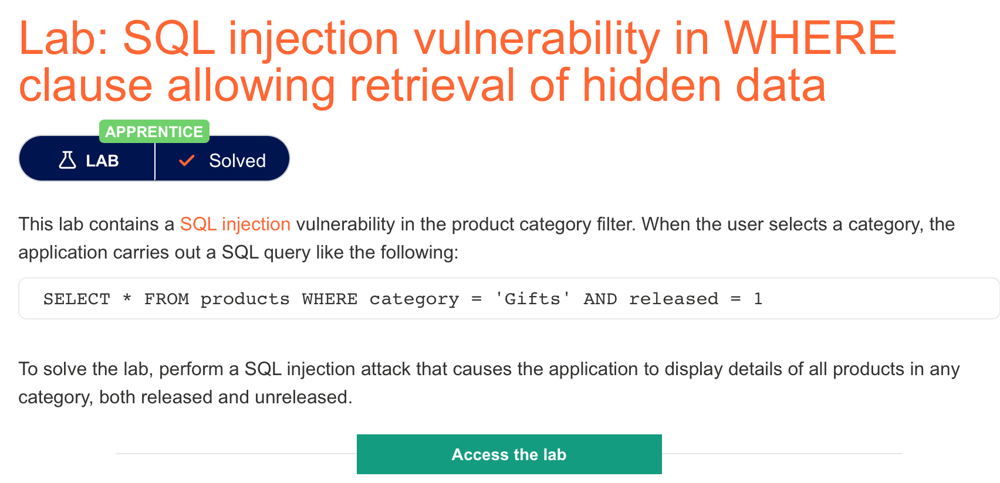

# 题意

该题的where查询字句中存在sql注入漏洞，攻击者可以借此获取隐藏数据。

能在页面中展示所有的产品信息即为解决。


# 解题过程
点击页面中的属性筛选，通过burpsuite可以category的值发生了改变。因此我们可以
通过修改category的值，让其变为一个永真式，来获得所有的数据。可用的表达式为：

```
'+OR+1=1--
```
其中--代表将后面的语句注释。
# 知识点
