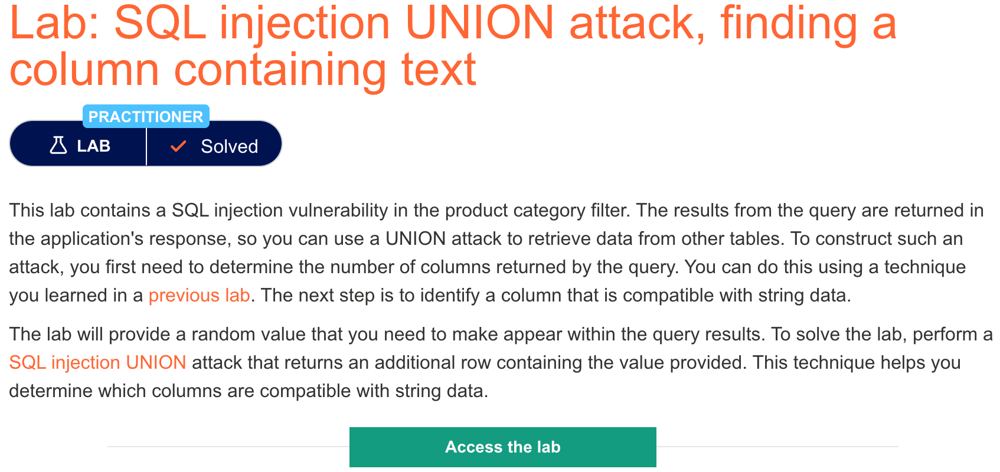

# 题意

该题只要将数据类型是string类的列找出来即可，payload中测试用的字符串要求使用给定的'Jwt0a6'。
# 解题思路
还是修改url中category的值。首先按照上一个实验的方法，用UNION SELECT搭配NULL确定列数。该题用了3个NULL，也就是3列。然后再将NULL替换为'Jwt0a6'。替换第2个时不再报错，意味着第二列就是要找的数据类型为string的列，成功解决。
# 知识点
## 如何找到数据类型兼容的列

一般来说，攻击者感兴趣的数据类型时string型，所以攻击时需要寻找至少一列能与string类型兼容的数据。再确定了列数之后，可以用UNION SELECT payload一列一列的尝试来确定哪些列是符合要求的。
```
' UNION SELECT 'a',NULL,NULL,NULL--
' UNION SELECT NULL,'a',NULL,NULL--
' UNION SELECT NULL,NULL,'a',NULL--
' UNION SELECT NULL,NULL,NULL,'a'--
```
如果某个UNION SELECT没有报错，那么字符a对应的列的数据类型是符合要求的。