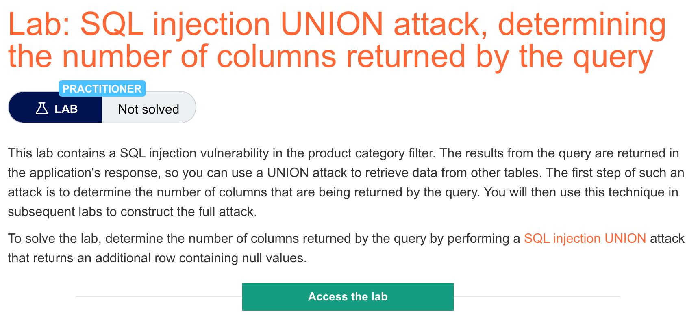

# 题意

该题只是对sql注入联合攻击中确定列数的测试。只要能够确定返回的结果中有多少列即可。
# 解题思路
总的来说还是修改url，两种办法都可以。


1.ORDER BY
修改category的值为 ‘+ORDER+BY+n;(n为大于0的正整数)，从1开始尝试直到报错，那么列数为n-1.


2.UNION SELECT NULL

修改category的值为‘+UNION+SELECT+NULL--，如果报错则增改为'+UNION+SELECT+NULL,NULL-- 直到不再报错。NULL的数目即为列数。
# 知识点
## sql注入联合攻击
当一个应用程序存在sql漏洞，并且sql的返回结果包含在应用程序的responses中时，就可以通过UNION关键字来获取数据库中其他数据表的数据。

UNION关键字可以同时运行多条SELECT语句并且将结果合并到一起。

一条包含UNION关键字的sql语句正常工作需要满足如下要求：

1.每条语句返回的结果的列数相等。


2.原始查询和注入查询中的数据类型兼容。

因此，要实施UNION attack就需要确定以下两个问题：
1.原始查询返回的列数是多少。


2.从原始查询返回的哪些列具有合适的数据类型来保存注入查询的结果。

## 如何确定原始查询返回的列数
通常有两种方法：


1.多次注入ORDER BY 字句


```
' ORDER BY 1
' ORDER BY 2
' ORDER BY 3
```
其中的数字代表列的索引，当索引溢出时则会报错：
```
The ORDER BY position number 3 is out of range of the number of items in the select list.
```

2.提交多个UNION SELECT


```
' UNION SELECT NULL--
' UNION SELECT NULL,NULL--
' UNION SELECT NULL,NULL,NULL--
```

如果null的数目与列数不匹配数据库就会报错：


```
All queries combined using a UNION, INTERSECT or EXCEPT operator must have an equal number of expressions in their target lists.
```


用NULL的原因：原始查询和注入查询之间的数据类型必须兼容，而NULL可以转换为各种通用的数据类型，可以最大化payload的成功率。

## 此外
oracle中每条SELECT语句必须用FROM关键字并且声明一张可用表，而oracle中内建了一张名叫dual的表，所以oracle的注入语句如下：
```
' UNION SELECT NULL FROM DUAL--
```

