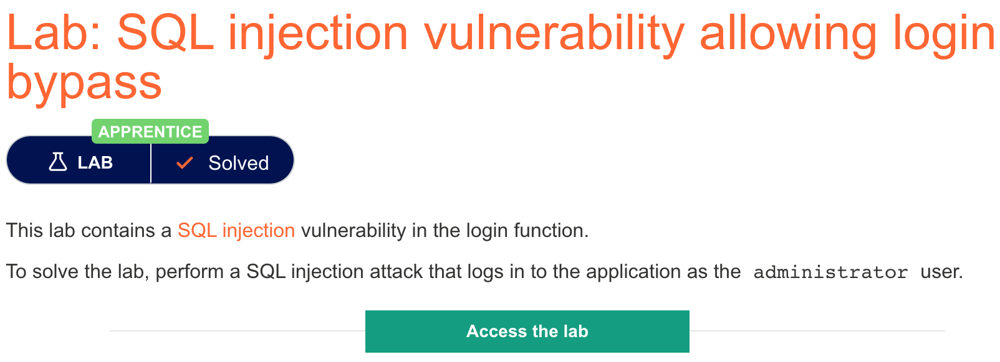
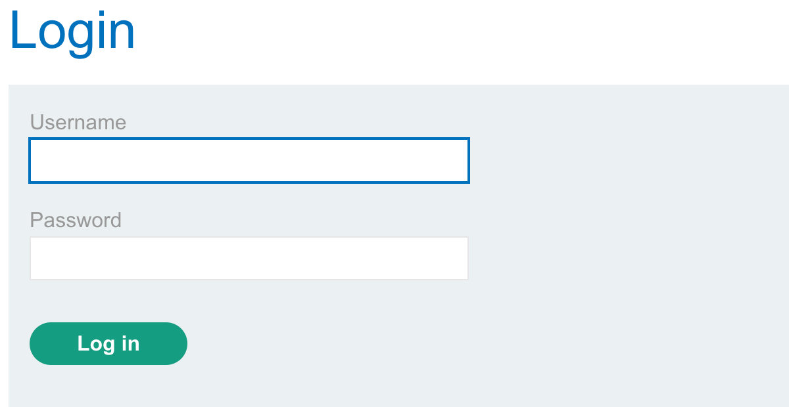

# 题意

登录功能的sql注入，能够在下图所示的登录界面用administrator登录即可。



# 解题思路
登录用到的sql语句如下：
```
SELECT * FROM users WHERE username = ' ' AND password = ''
```
很容易想到，既然题目要求用administrator登录，那么这个账号肯定已经在数据库中存在了，因此只要将后面对password的判断注释即可。payload为：
```
administraotr'--
```
# 知识点
