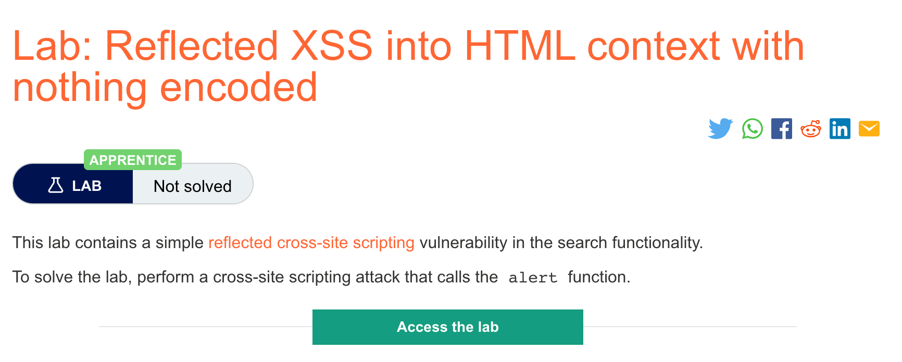

# 题意

能唤起alert()函数即可
# 解题思路

在搜索栏中输入如下payload：
```
<script>alert(1)</script>
```
即可
# 知识点
## XSS跨站脚本攻击
XSS能让攻击者危及用户与应用程序的交互，让攻击者规避同源策略。同源策略能把不同的网站之间隔离起来。XSS能让攻击者伪装成合法用户从而获取用户信息等。如果该用户权力足够，攻击者还可以完全控制应用程序。

## 原理
通过操作带有漏洞的网站从而向用户返回恶意JS。当恶意代码在受害者的浏览器中执行时，攻击者就能与应用程序进行交互了。大部分XSS都是通过注入一段能够让浏览器执行任意JS的payload。一般通过alert()函数实现。因为它简单、无害并且在成功调用后不容易丢失。而labs中大部分也是通过唤醒模拟的用户浏览器中的alert()来解决的。然而Chrome从92版本开始不再能通过调用alert()来触发XSS了。这时就需要一些PoC。

## 类型
XSS分为三种：
反射型  恶意JS来自HTTP请求
存储型  恶意JS来自网站的数据库
DOM型  漏洞存在于用户端代码而不是服务端代码

##  反射型XSS
反射型是最简单的一种XSS。当应用程序接收来自HTTP请求的数据并且用不安全的方式将数据包含在响应中时就会触发。例如：
```
https://insecure-website.com/status?message=All+is+well.
<p>Status: All is well.</p>
```

应用程序没有对数据进行任何处理，因此攻击者可以轻易地构建如下攻击：
```
https://insecure-website.com/status?message=<script>/*+Bad+stuff+here...+*/</script>
<p>Status: <script>/* Bad stuff here... */</script></p>
```
如果用户访问了攻击者构建的URL，那么攻击者的脚本就会在用户的浏览器中执行,并且有用户的session。

## 反射性XSS的影响
1. 进行用户可以进行的任何操作
2. 浏览用户可以浏览的信息
3. 修改用户可以修改的信息
4. 与应用程序的其他用户交互，包括攻击者


# 发现反射型XSS
用burpsuite的web漏洞scanner。

一般包括如下几步：
1. 测试进入点。用应用程序的http请求中的数据分别测试每个进入点。数据包括参数或者URL和消息体中的其他数据，还有URL文件路径。请求头中的数据也可以，但是练习中可能不会利用到那种只能通过请求头中的数据触发的XSS漏洞。


2. 提交随机字符串。给每个进入点都提交一个唯一的随机字符串来确定该字符串是否在响应当中反射。字符串应当能通过大部分校验，并且足够短，同时包含数字和字母。一般来说长度在8左右比较好，


3. 确定反射的上下文。这些进入点可能会在HTML标签的文本当中；可能会在某个被引用的标签属性中，在JS字符串中等等。

4. 确定可用的payload。用burpsuite repeator模块。

5. 在浏览器中实施攻击。ß