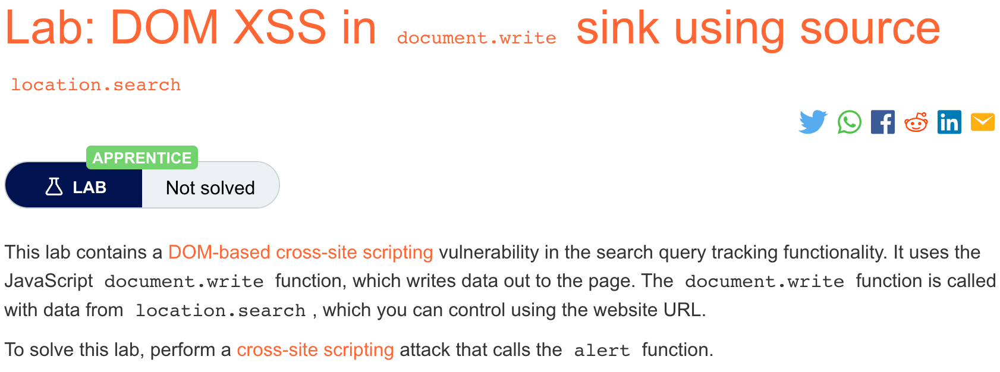
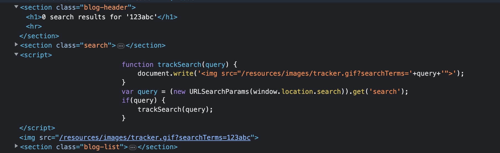

# 题意

该dom漏洞source为location.search，sink为document.write
利用该漏洞唤起aler()即可。
# 解题思路
step1：输入任意字符串搜索并查看源码


可以看到输入的字符串‘123abc’出现了两次。第一次出现在h1标签中。这里是作为服务器http响应中的部分，可以用作反射型XSS攻击。第二次出现，该字符串作为JS脚本的实参存在。该脚本初始化了一个函数，通过调用document.write（）函数和参数query来对dom进行修改。这里就可以实施dom型XSS。

step2:输入payload
在搜索栏输入如下payload即可：
```
"><svg onload=alert(1)>
```
或者：
```
123abc" onload="alert(1)
```
# 知识点
## dom
DOM（Document Object Model）即文档对象模型，是HTML和XML文档的编程接口。

其中HTML DOM定义了所有HTML元素的对象和属性，以及访问它们的方法。换言之，HTML DOM是关于如何获取、修改、添加或删除HTML元素的标准。

DOM以树结构表达HTML文档。

## dom型XSS

DOM型XSS是基于DOM文档对象模型的一种漏洞。严格地说，DOM型XSS其实算反射型XSS，区别在于DOM型XSS并不会和后台进行交互，是完完全全的Web前端安全问题，要做防御也只能在客户端上进行防御。


首先，客户端的脚本程序可以通过DOM动态地检查和修改页面内容，它并不与服务端进行交互而是从客户端获得DOM中的数据（如从URL中获取数据）并在本地执行；其次，浏览器用户可以操纵DOM中的一些对象如URL、location等；因此，DOM型XSS中，其外部输入是JS中存在获取外部输入内容的可利用的代码如URL栏内容的location.href，然后该外部输入内容在未经过有效过滤的情况下就传入危险的输出函数直接输出到页面中或传入eval等危险执行函数就会在页面上直接解析恶意JS代码，导致DOM型XSS的存在。

## 常见外部输入sources和敏感操作sinks


Sources

document.URL

document.URLUnencoded

document.location（及其许多属性）

document.referrer

window.location（及其许多属性）

location

location.href

location.search

location.hash

location.pathname


Sinks

直接执行脚本类

eval(…)

window.execScript(…)

window.setInterval(…)

window.setTimeout(…)

写HTML页面类

document.write(…)

document.writeln(…)

element.innerHTML(…)

直接修改DOM类

document.forms[0].action=… (and various other collections)

document.attachEvent(…)

document.create…(…)

document.execCommand(…)

document.body. … (accessing the DOM through the body object)

window.attachEvent(…)

替换文档URL类

document.location=… (and assigning to location’s href, host and hostname)

document.location.hostname=…

document.location.replace(…)

document.location.assign(…)

document.URL=…

window.navigate(…)

打开/修改窗口类

document.open(…)

window.open(…)

window.location.href=… (and assigning to location’s href, host and hostname)