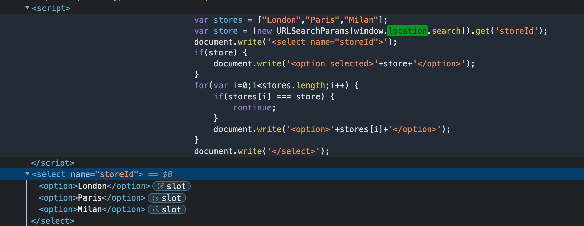

# 题意


与之前的题目不同的是，该题的url查询部分包含在一个select元素中。完成条件是打破select并且唤起alert
# 解题思路
step1:打开开发者模式查看源码


可以看到该JS脚本的本意是让变量store只能等于select元素中给定的几个值，并且location.search().get()的参数是storeId，因此就需要在传入的url中对storeId进行设置，而storeId本身又被包括在select元素中，因此需要打破select元素。


step2:传入url

在网页的url后添加如下payload
```
product?productId=1&storeId="></select>
```
'&'新增storeId参数，让location.search能够检测得到；

/select 闭合掉select标签，让后面的语句能够执行。

img标签中src设置成一个非法值，抛出异常执行后面的onerror，唤醒alert()
# 知识点