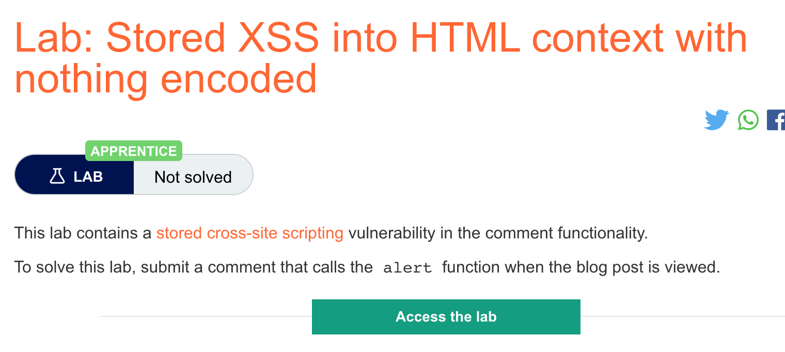

# 题意

该实验中评论功能存在存储型XSS漏洞，


提交一个注释唤起alert()函数即可。
# 解题思路
在评论页面输入
```
<script>alert(1)</script>
```
即可。
# 知识点
## 存储型XSS
与反射型XSS的区别：就可利用性而言，反射型 XSS 和存储型 XSS 之间的主要区别在于存储型 XSS 漏洞可以实现应用程序本身的自包含攻击。意思就是反射型XSS需要受害用户往攻击则设定好的URL发起请求。而存储型XSS就不需要，它的恶意代码存储在服务器，用户只要访问该页面就有可能触发漏洞。