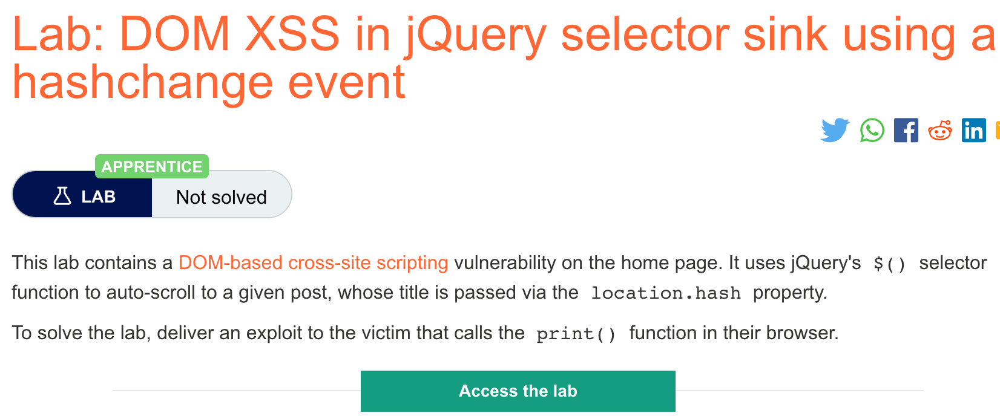
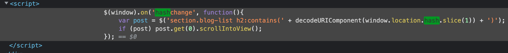
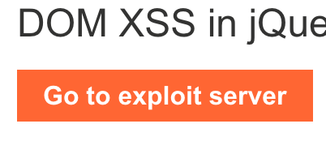

# 题意

该实验中，home页面存在DOM型XSS。sink为$选择符，source为location.hash.
实验要求让受害者的浏览器调用print()函数。
# 解题思路
step1：打开开发者模式查看带有漏洞的代码处


step2:打开exploit server


step3:在body处添加如下payload
```
<iframe src="https://YOUR-LAB-ID.web-security-academy.net/#" onload="this.src+=''"></iframe>
```

注意，要将YOUR-LAB-ID改成当前实验的labid。

step4:分别点击View exploit和Deliver exploit to victim

可以看到print()被一直调用。


# 知识点
jQuery used to be extremely popular, and a classic DOM XSS vulnerability was caused by websites using this selector in conjunction with the location.hash source for animations or auto-scrolling to a particular element on the page. This behavior was often implemented using a vulnerable hashchange event handler, similar to the following:

JQuery过去十分流行。一种经典的DOM型XSS就由$选择符和location.hash分别作为sink和source造成的，经常伴随着一个有漏洞的事件handler：hashchange。例子如下：
```
$(window).on('hashchange', function() {
	var element = $(location.hash);
	element[0].scrollIntoView();
});
```

因为hash是用户可以控制的，所以攻击者可以利用这点向$()注入一个XSSvector。利用这个漏洞，需要找到一个不需要用户交互就能触发事件handler的方法，最简单的一种方法就是通过iframe：
```
<iframe src="https://vulnerable-website.com#" onload="this.src+=''">
```


上例中，src参数带着一个空的hash值指向了漏洞页面，当该iframe被加载时，就会有一个XSSvector添加到hash中并触发hashchange。