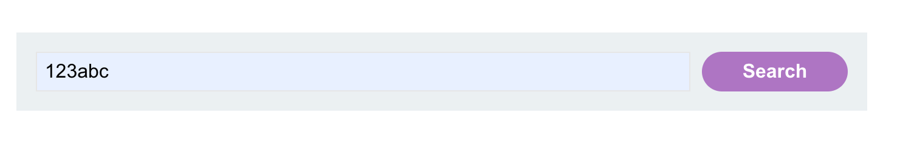
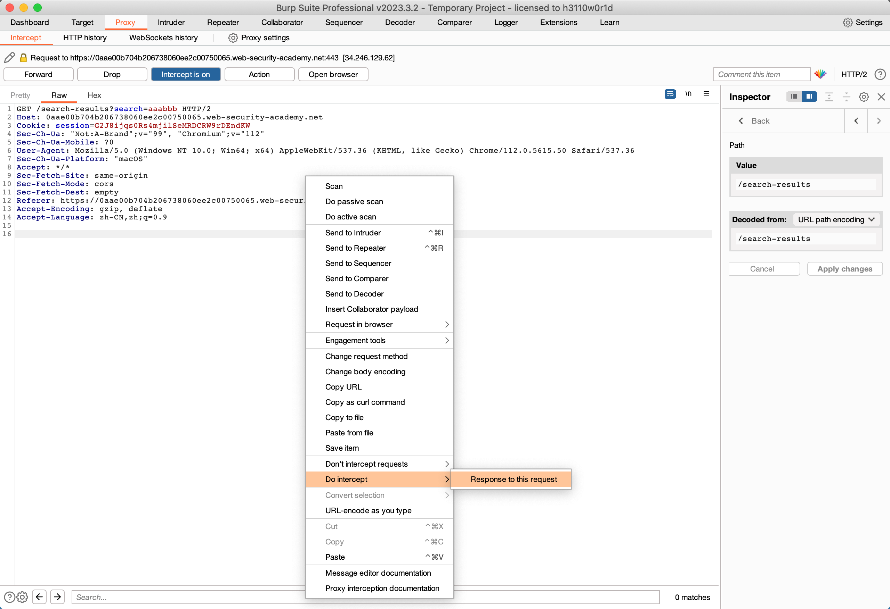
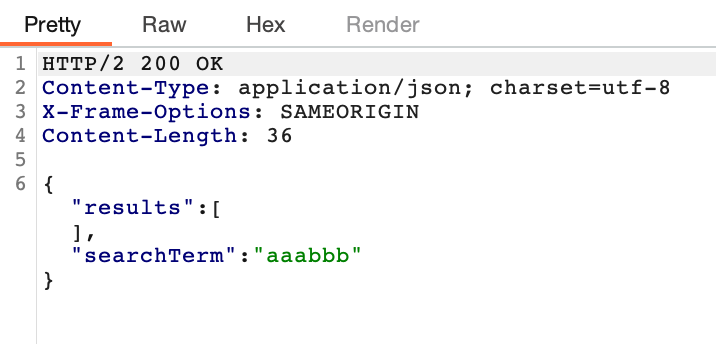
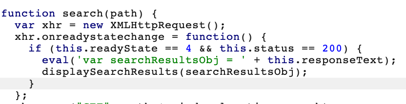
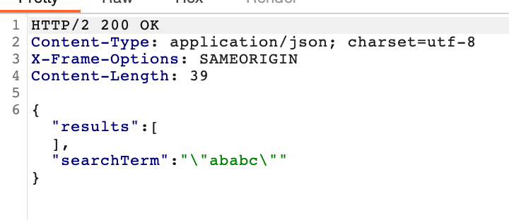
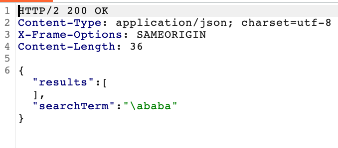

# 题意

# 解题思路
step1:用burpsuite获取信息
开启burpsuite的intercept模块后，在网页中搜索随机字符串，并用intercept拦截返回包。


可以看到返回的数据是json格式

这个动作也可以用repeator实现。

step2:查看search-Result.js源码
打开target模块找到search-Result.js文件

可以看到该js用了eval()函数

step3:用字符串进行测试

可以看到JSON响应转义了双引号。

但是没有转义反斜杠



step4:准备payload并注入
由第三步得到的信息，应该输入如下payload：
```
\"-alert(1)}//
```
双反斜杠造成对双引号的转义失效，进而闭合了用作搜索的字符串。再用一个运算符（这里是-）隔开alert()前的表达式，再用两个斜杠闭合掉json对象并且注释掉后面的语句。最终，该response生成如下：
```
{"searchTerm":"\\"-alert(1)}//", "results":[]}
```
# 知识点
## DOM型与反射型或存储型XSS组合

一些纯DOM型漏洞是自包含在一个网页中的。如果脚本从URL读取数据并且将其写到一个危险的sink，那么这个漏洞就是完全客户端的。然而，sources不只是局限在被浏览器暴露的数据，这些数据也可以来自网站。例如，网站经常用http响应从服务器反射URL参数。这通常会联系到普通的XSS，但是也能导致反射型DOMXSS。

反射型DOMXSS中，服务器从请求中获取数据，并且输入到响应中。响应中的数据又可能输入到JS字符串或者DOM中。脚本进而用不安全的方式处理这些反射数据，例如写到危险的sink中去。

## eval()
eval() 的参数是一个字符串。如果字符串表示的是表达式，eval() 会对表达式进行求值。如果参数表示一个或多个 JavaScript 语句，那么eval() 就会执行这些语句。不需要用 eval() 来执行一个算术表达式：因为 JavaScript 可以自动为算术表达式求值。
eval() 是一个危险的函数，它使用与调用者相同的权限执行代码。如果你用 eval() 运行的字符串代码被恶意方（不怀好意的人）修改，您最终可能会在您的网页/扩展程序的权限下，在用户计算机上运行恶意代码。