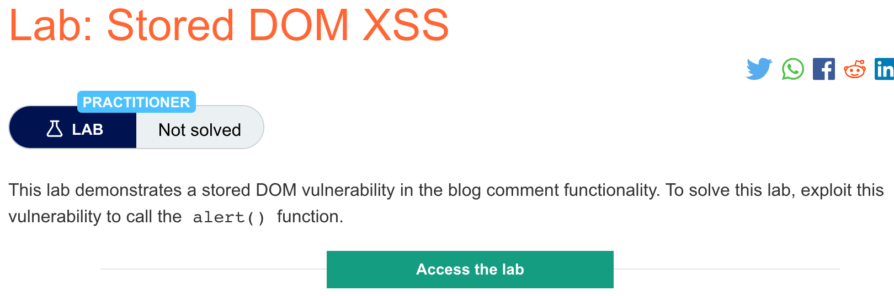
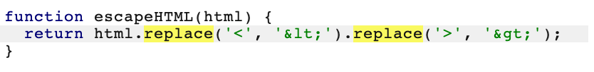

# 题意

实验中的评论功能存在存储型DOM漏洞，唤起alert()函数即可。

# 解题思路
step1:用burpsuite查看网页源码

可以看到.js文件中用replace来编码尖括号。然而，当第一个参数是字符串时，该函数只会编码第一对出现的尖括号而忽略后面的。所以可以通过在评论的开头额外添加一对尖括号来利用这个漏洞。开头这一对尖括号会被编码，但是后序字符串中的尖括号会被忽略，让攻击者能够绕过过滤并且注入html。


step：输入payload
由第一步的推论，我们可以得到如下payload：
```
<>
```
在评论区输入该payload即可。

# 知识点