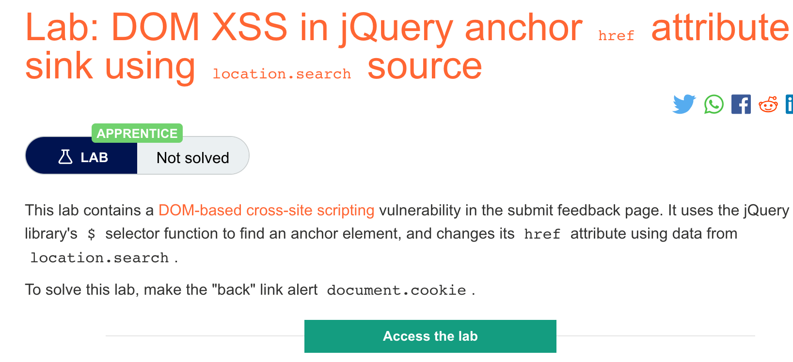
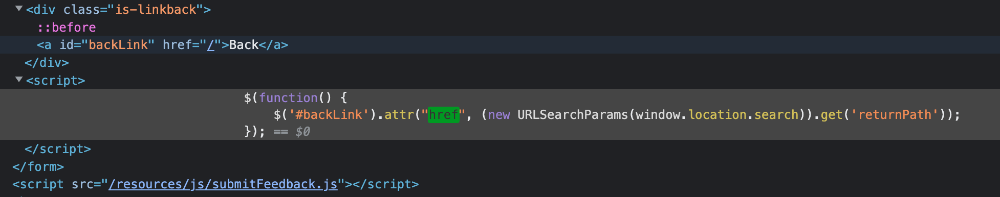

# 题意


该实验中的submit feedback页面存在DOM型XSS。sink为attr()函数，source为location.search

把back链接改成可以alert document.cookie即可
# 解题思路
step1:打开开发者模式查看源码




可以看到这段脚本的意思是将back链接设置为returnPath。

step2:输入payload

在url中的returnPath=后添加如下payloaad即可：
```
javascript:alert(document.cookie)
```
# 知识点

## jQuery中的DOMXSS
If a JavaScript library such as jQuery is being used, look out for sinks that can alter DOM elements on the page. For instance, jQuery's attr() function can change the attributes of DOM elements. If data is read from a user-controlled source like the URL, then passed to the attr() function, then it may be possible to manipulate the value sent to cause XSS. For example, here we have some JavaScript that changes an anchor element's href attribute using data from the URL:
类似的，如果有例如JQuery的JS库被使用，就需要去寻找那些能修改页面上的DOM元素的sinks。例如，JQuery中的attr()函数能够改变dom属性的参数。如果数据来自于例如URl这样的用户控制的数据源，并且数据被送给attr()函数，那么就可以通过修改被发送的数据来造成XSS漏洞。例如，以下是用URL中的数据来修改anchor属性的href参数的JS脚本：
```
$(function() {
	$('#backLink').attr("href",(new URLSearchParams(window.location.search)).get('returnUrl'));
});
```
可以在URL后添加如下payload来让用户访问恶意网址。
```
?returnUrl=javascript:alert(document.domain)
```