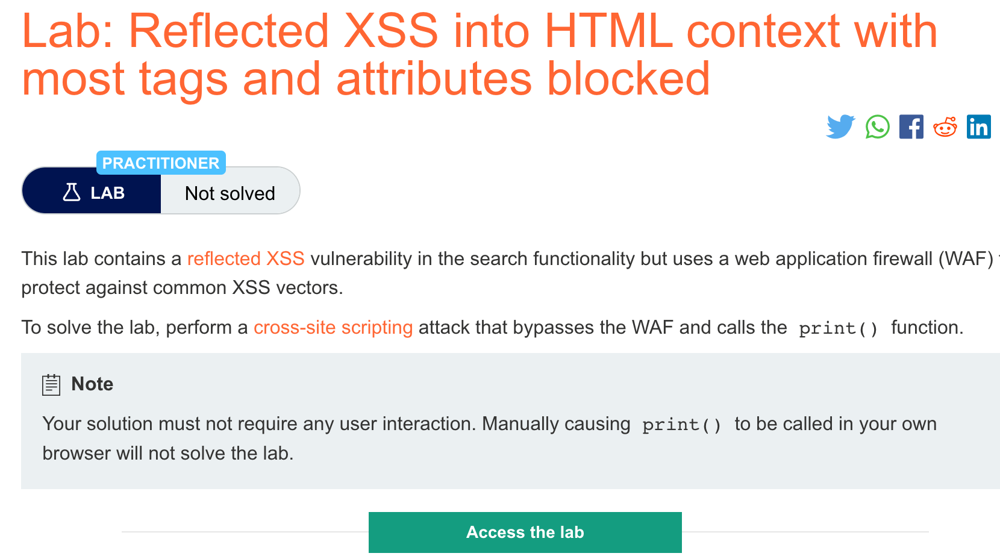
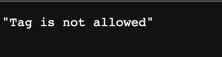
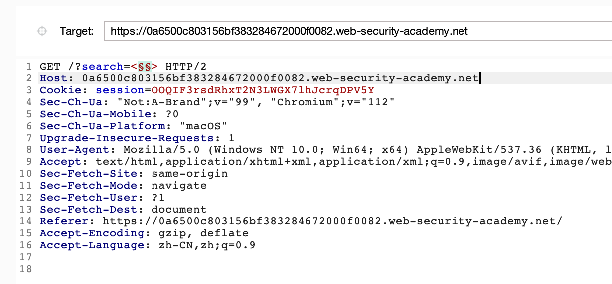
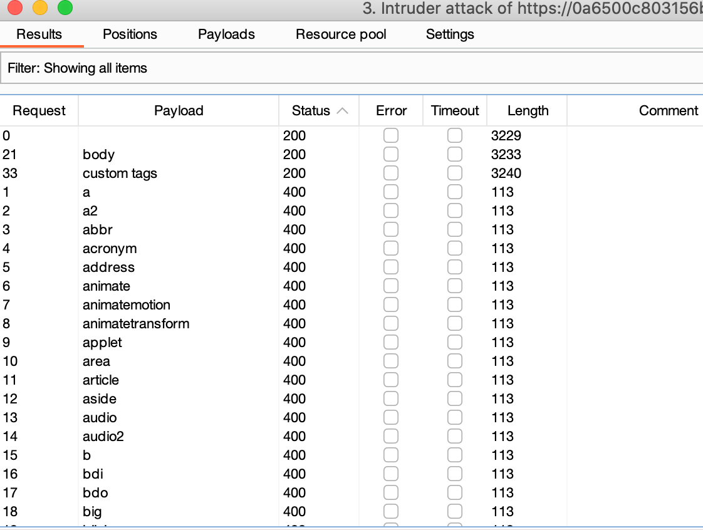
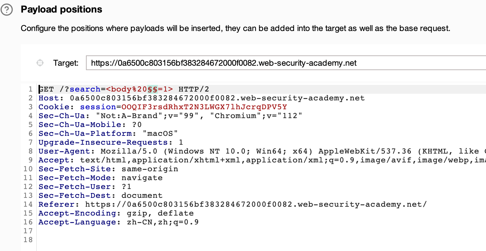
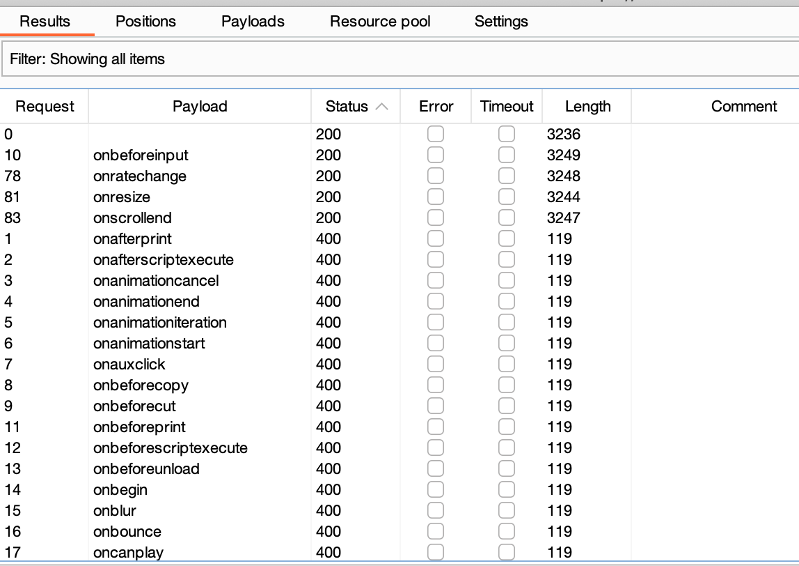
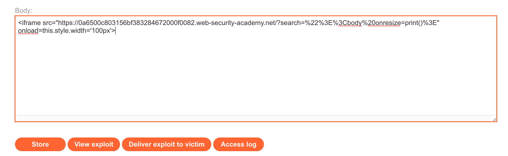

# 题意

该实验中的搜索功能包含XSS漏洞但是应用程序拥有WAF来防御一般的XSS，因此，需要绕过WAF来利用WAF唤起print()函数。
# 解题思路
step1:

注入一般的XSSpayload，发现被WAF拦截。



step2:

打开burpsuite的[XSS上下文表单](https://portswigger.net/web-security/cross-site-scripting/cheat-sheet),并复制所有的标签。


step3:
打开burpsuite intruder设置payload,将复制好的标签粘贴到payload settings里，确定哪一种标签可用。


得到如下结果,可以确定body标签可用：



step4:
打开burpsuite上下文表达，复制所有的事件


step5:

还是设置payload，确定哪一个事件是可用的




得到如下结果,onbeforeinput可用：


step6:

综上可以确定body标签和onbeforeinput可用，在expolit server输入如下payload,点击stored和deliver即可。
```
<iframe src="https://YOUR-LAB-ID.web-security-academy.net/?search=%22%3E%3Cbody%20onresize=print()%3E" onload=this.style.width='100px'>
```

# 知识点

## XSS上下文
测试反射型和存储型XSS的时候，关键在于确认XSS的上下文，包括：

响应中攻击者可控的数据出现的位置。

应用程序对数据进行的何种处理。

基于这些细节，可以选择一种或者多种payloads，并测试它们是否可用。


## html标签间的XSS
当XSS上下文在html标签之间时，需要引入一些新的html来触发JS的执行。例如：

```
<script>alert(document.domain)</script>

```